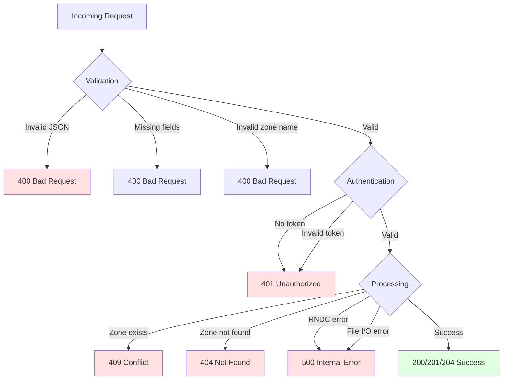

# Architecture Deep Dive

Deep dive into bindcar's internal architecture.

## Component Architecture

bindcar is built using Rust and the Axum web framework:

### Core Technologies

- **axum**: HTTP server and routing
- **tokio**: Async runtime and process execution
- **serde**: JSON serialization/deserialization
- **tracing**: Structured logging and observability

## Request Processing Flow

Complete request lifecycle from HTTP request to response:

## Code Structure

### Module Responsibilities

- **main.rs**: Application entry point, server configuration, dependency injection
- **api.rs**: HTTP route definitions, request/response handlers, OpenAPI specs
- **auth.rs**: Bearer token validation, Kubernetes ServiceAccount auth
- **rndc.rs**: RNDC command execution, process management, error handling
- **zones.rs**: Zone file generation, file I/O, zone lifecycle management
- **models.rs**: Request/response types, serialization, validation

## Async Processing Architecture

All I/O operations use async/await for non-blocking execution:

### Benefits

- **Non-blocking HTTP handling**: Concurrent request processing
- **Async process execution**: Non-blocking RNDC command execution
- **Concurrent operations**: Multiple zones can be managed simultaneously
- **Efficient resource usage**: Small thread pool handles many concurrent operations

## Error Handling Strategy

Structured error types with proper HTTP status code mapping:

### Error Type Mapping

| Error Type | HTTP Status | Use Case |
|------------|-------------|----------|
| ValidationError | 400 Bad Request | Invalid input data |
| AuthenticationError | 401 Unauthorized | Missing/invalid token |
| NotFoundError | 404 Not Found | Zone doesn't exist |
| ConflictError | 409 Conflict | Zone already exists |
| InternalError | 500 Internal Server Error | File I/O failures |
| RndcError | 500 Internal Server Error | RNDC command failures |

## Next Steps

- [RNDC Integration](./rndc-integration.md) - RNDC details
- [Contributing](./contributing.md) - Contribution guide
