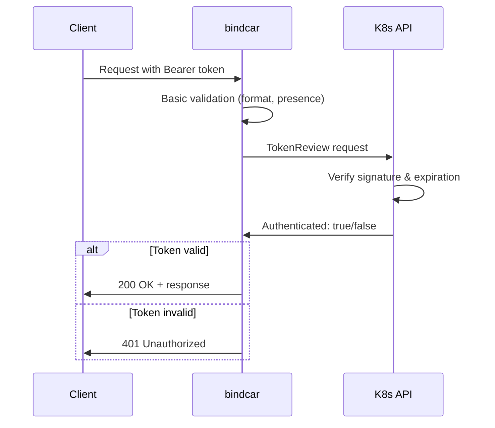

# Kubernetes TokenReview Validation

This guide explains how to use the Kubernetes TokenReview API integration for enhanced authentication security.

## Overview

bindcar supports two authentication modes:

1. **Basic Mode** (default) - Validates token presence and format only
2. **TokenReview Mode** (optional) - Validates tokens against Kubernetes API

## Basic Mode (Default)

The default authentication mode performs basic validation:

- ✅ Checks Authorization header is present
- ✅ Validates Bearer token format
- ✅ Ensures token is not empty
- ❌ Does NOT verify token signature
- ❌ Does NOT check expiration
- ❌ Does NOT validate with Kubernetes

**Best for:**
- Trusted environments (internal networks)
- When using external authentication (API gateway, service mesh like Linkerd)
- Development and testing

```rust
// No special configuration needed - this is the default
bindcar = "0.1"
```

## TokenReview Mode (Feature: k8s-token-review)

When enabled, bindcar validates tokens using the Kubernetes TokenReview API:

- ✅ All basic validations
- ✅ Verifies token signature with Kubernetes API
- ✅ Checks token expiration
- ✅ Validates token audience
- ✅ Validates service account exists
- ✅ Restricts to allowed namespaces (configurable)
- ✅ Restricts to allowed service accounts (configurable)
- ✅ Returns authenticated user information

**Best for:**
- Production environments requiring strict security
- Multi-tenant Kubernetes clusters
- Compliance requirements
- When not using external authentication

### Enabling TokenReview Validation

Add the feature to your `Cargo.toml`:

```toml
[dependencies]
bindcar = { version = "0.1", features = ["k8s-token-review"] }
```

Or build with the feature:

```bash
cargo build --features k8s-token-review
```

### Requirements

**In-Cluster Deployment:**
- ServiceAccount with TokenReview permissions
- RBAC permissions configured

**Local Development:**
- Valid kubeconfig file (~/.kube/config)
- Kubernetes cluster access

## Security Configuration

bindcar supports fine-grained access control through environment variables:

### Environment Variables

| Variable | Description | Default | Example |
|----------|-------------|---------|---------|
| `BIND_TOKEN_AUDIENCES` | Comma-separated list of expected token audiences | `bindcar` | `bindcar,dns-api` |
| `BIND_ALLOWED_NAMESPACES` | Comma-separated list of allowed namespaces | None (allow all) | `dns-system,kube-system` |
| `BIND_ALLOWED_SERVICE_ACCOUNTS` | Comma-separated list of allowed service accounts | None (allow all) | `system:serviceaccount:dns-system:external-dns` |

### Audience Validation

Token audience validation ensures tokens are issued specifically for bindcar:

```yaml
# In your deployment
env:
- name: BIND_TOKEN_AUDIENCES
  value: "bindcar,https://bindcar.dns-system.svc.cluster.local"
```

**How it works:**
- Tokens must be created with matching audience
- Prevents token reuse across different services
- Provides defense-in-depth security

**Create tokens with audience:**
```bash
kubectl create token external-dns --audience=bindcar
```

### Namespace Restriction

Limit which namespaces can authenticate to bindcar:

```yaml
# Only allow tokens from dns-system and kube-system
env:
- name: BIND_ALLOWED_NAMESPACES
  value: "dns-system,kube-system"
```

**Use cases:**
- Multi-tenant clusters with namespace isolation
- Restrict DNS management to specific namespaces
- Compliance requirements

**Example rejection:**
```
Token validation failed: ServiceAccount from unauthorized namespace: default
```

### ServiceAccount Allowlist

Explicitly allow specific service accounts:

```yaml
# Only allow specific service accounts
env:
- name: BIND_ALLOWED_SERVICE_ACCOUNTS
  value: "system:serviceaccount:dns-system:external-dns,system:serviceaccount:dns-system:cert-manager"
```

**Format:** `system:serviceaccount:<namespace>:<name>`

**Use cases:**
- Zero-trust security model
- Explicit authorization required
- Audit and compliance tracking

**Example rejection:**
```
Token validation failed: ServiceAccount not authorized: system:serviceaccount:default:my-app
```

### Configuration Best Practices

**Development:**
```yaml
# Relaxed - allow all namespaces
env:
- name: BIND_TOKEN_AUDIENCES
  value: "bindcar"
# BIND_ALLOWED_NAMESPACES: not set (allow all)
# BIND_ALLOWED_SERVICE_ACCOUNTS: not set (allow all)
```

**Staging:**
```yaml
# Moderate - restrict namespaces
env:
- name: BIND_TOKEN_AUDIENCES
  value: "bindcar"
- name: BIND_ALLOWED_NAMESPACES
  value: "dns-system,test-system"
```

**Production:**
```yaml
# Strict - explicit allowlist
env:
- name: BIND_TOKEN_AUDIENCES
  value: "bindcar,https://bindcar.dns-system.svc.cluster.local"
- name: BIND_ALLOWED_NAMESPACES
  value: "dns-system"
- name: BIND_ALLOWED_SERVICE_ACCOUNTS
  value: "system:serviceaccount:dns-system:external-dns"
```

### ConfigMap Alternative

For large allowlists, use a ConfigMap:

```yaml
apiVersion: v1
kind: ConfigMap
metadata:
  name: bindcar-allowed-accounts
  namespace: dns-system
data:
  allowed-service-accounts: |
    system:serviceaccount:dns-system:external-dns
    system:serviceaccount:dns-system:cert-manager
    system:serviceaccount:dns-system:ingress-dns
---
apiVersion: apps/v1
kind: Deployment
spec:
  template:
    spec:
      containers:
      - name: bindcar
        env:
        - name: BIND_ALLOWED_SERVICE_ACCOUNTS
          valueFrom:
            configMapKeyRef:
              name: bindcar-allowed-accounts
              key: allowed-service-accounts
```

**Note:** ConfigMap values are newline-separated, not comma-separated. You'll need to adjust the parsing or use commas in the ConfigMap.

## RBAC Configuration

When using TokenReview mode, bindcar needs permission to create TokenReview objects.

### Create ServiceAccount

```yaml
apiVersion: v1
kind: ServiceAccount
metadata:
  name: bindcar
  namespace: dns-system
```

### Create ClusterRole

```yaml
apiVersion: rbac.authorization.k8s.io/v1
kind: ClusterRole
metadata:
  name: bindcar-tokenreview
rules:
- apiGroups: ["authentication.k8s.io"]
  resources: ["tokenreviews"]
  verbs: ["create"]
```

### Create ClusterRoleBinding

```yaml
apiVersion: rbac.authorization.k8s.io/v1
kind: ClusterRoleBinding
metadata:
  name: bindcar-tokenreview
roleRef:
  apiGroup: rbac.authorization.k8s.io
  kind: ClusterRole
  name: bindcar-tokenreview
subjects:
- kind: ServiceAccount
  name: bindcar
  namespace: dns-system
```

Apply the RBAC configuration:

```bash
kubectl apply -f rbac.yaml
```

## How TokenReview Works



## API Reference

### TokenReview Request

The TokenReview API validates a token:

```json
{
  "apiVersion": "authentication.k8s.io/v1",
  "kind": "TokenReview",
  "spec": {
    "token": "eyJhbGci..."
  }
}
```

### TokenReview Response

Successful validation:

```json
{
  "apiVersion": "authentication.k8s.io/v1",
  "kind": "TokenReview",
  "status": {
    "authenticated": true,
    "user": {
      "username": "system:serviceaccount:default:my-app",
      "uid": "12345",
      "groups": ["system:serviceaccounts", "system:authenticated"]
    }
  }
}
```

Failed validation:

```json
{
  "apiVersion": "authentication.k8s.io/v1",
  "kind": "TokenReview",
  "status": {
    "authenticated": false,
    "error": "token is expired"
  }
}
```

## Error Messages

### With TokenReview Enabled

| Error | Description | Status Code |
|-------|-------------|-------------|
| `Missing Authorization header` | No auth header provided | 401 |
| `Invalid Authorization header format` | Not "Bearer <token>" format | 401 |
| `Empty token` | Token is empty string | 401 |
| `Failed to create Kubernetes client` | Cannot connect to K8s API | 401 |
| `Token validation failed: <reason>` | TokenReview rejected token | 401 |
| `Token not authenticated` | K8s says token is invalid | 401 |
| `ServiceAccount from unauthorized namespace: <ns>` | Token from blocked namespace | 401 |
| `ServiceAccount not authorized: <name>` | Token not in allowlist | 401 |
| `No user information in TokenReview response` | TokenReview missing user data | 401 |

## Testing

### Unit Tests

Run tests without TokenReview:

```bash
cargo test
```

Run tests with TokenReview (requires cluster):

```bash
K8S_OPENAPI_ENABLED_VERSION=1.30 cargo test --features k8s-token-review
```

### Integration Testing

Test with a real Kubernetes cluster:

```bash
# Get a valid service account token
TOKEN=$(kubectl create token my-app -n default)

# Test authentication
curl -H "Authorization: Bearer $TOKEN" \
  http://localhost:8080/api/v1/zones
```

### Testing Invalid Tokens

```bash
# Test with expired token
curl -H "Authorization: Bearer invalid-token" \
  http://localhost:8080/api/v1/zones

# Expected: 401 Unauthorized
# {
#   "error": "Token validation failed: token not authenticated"
# }
```

### Testing Security Restrictions

**Test audience validation:**
```bash
# Create token without audience
TOKEN=$(kubectl create token my-app)
curl -H "Authorization: Bearer $TOKEN" http://localhost:8080/api/v1/zones
# Expected: May fail if BIND_TOKEN_AUDIENCES requires specific audience

# Create token with correct audience
TOKEN=$(kubectl create token my-app --audience=bindcar)
curl -H "Authorization: Bearer $TOKEN" http://localhost:8080/api/v1/zones
# Expected: Success (if other validations pass)
```

**Test namespace restriction:**
```bash
# Set allowed namespaces
export BIND_ALLOWED_NAMESPACES="dns-system"

# Create token from allowed namespace
kubectl create serviceaccount test-sa -n dns-system
TOKEN=$(kubectl create token test-sa -n dns-system --audience=bindcar)
curl -H "Authorization: Bearer $TOKEN" http://localhost:8080/api/v1/zones
# Expected: Success

# Create token from blocked namespace
kubectl create serviceaccount test-sa -n default
TOKEN=$(kubectl create token test-sa -n default --audience=bindcar)
curl -H "Authorization: Bearer $TOKEN" http://localhost:8080/api/v1/zones
# Expected: 401 Unauthorized
# {"error": "Token validation failed: ServiceAccount from unauthorized namespace: default"}
```

**Test service account allowlist:**
```bash
# Set allowed service accounts
export BIND_ALLOWED_SERVICE_ACCOUNTS="system:serviceaccount:dns-system:external-dns"

# Create allowed service account
kubectl create serviceaccount external-dns -n dns-system
TOKEN=$(kubectl create token external-dns -n dns-system --audience=bindcar)
curl -H "Authorization: Bearer $TOKEN" http://localhost:8080/api/v1/zones
# Expected: Success

# Create blocked service account
kubectl create serviceaccount other-app -n dns-system
TOKEN=$(kubectl create token other-app -n dns-system --audience=bindcar)
curl -H "Authorization: Bearer $TOKEN" http://localhost:8080/api/v1/zones
# Expected: 401 Unauthorized
# {"error": "Token validation failed: ServiceAccount not authorized: system:serviceaccount:dns-system:other-app"}
```

## Performance Considerations

### TokenReview API Latency

Each request with TokenReview enabled makes an additional API call to Kubernetes:

- **In-cluster**: ~5-20ms typical latency
- **Remote cluster**: Depends on network latency

### Caching Recommendations

For high-traffic deployments, consider:

1. **Use external authentication** (API gateway with caching)
2. **Service mesh** (Linkerd, Istio) handles auth at the proxy level
3. **Token caching** (future enhancement) - cache validated tokens

### When to Use Each Mode

| Scenario | Recommended Mode |
|----------|------------------|
| Development | Basic (default) |
| Internal network only | Basic |
| With API gateway auth | Basic |
| With service mesh (Linkerd) | Basic |
| Multi-tenant production | TokenReview |
| Compliance requirements | TokenReview |
| Public-facing API | TokenReview + rate limiting |

## Troubleshooting

### "Failed to create Kubernetes client"

**Cause**: Cannot connect to Kubernetes API server

**Solutions**:
```bash
# Check kubeconfig
kubectl cluster-info

# Verify service account has access
kubectl auth can-i create tokenreviews --as=system:serviceaccount:dns-system:bindcar

# Check in-cluster config
kubectl get serviceaccount bindcar -n dns-system
```

### "TokenReview API call failed"

**Cause**: RBAC permissions not configured

**Solution**:
```bash
# Apply RBAC configuration
kubectl apply -f rbac.yaml

# Verify role binding
kubectl get clusterrolebinding bindcar-tokenreview
```

### Performance Issues

**Symptom**: Slow API responses

**Analysis**:
```bash
# Check TokenReview API latency
kubectl get --raw /apis/authentication.k8s.io/v1/tokenreviews \
  --v=8 2>&1 | grep "Request Headers"
```

**Solutions**:
- Use basic mode with external auth
- Deploy bindcar in-cluster for lower latency
- Use service mesh for auth

## Security Best Practices

1. **Always use HTTPS** - Never send tokens over HTTP
2. **Rotate tokens regularly** - Use short-lived tokens when possible
3. **Least privilege** - Only grant necessary permissions
4. **Audit logs** - Enable Kubernetes audit logging for TokenReview
5. **Rate limiting** - Prevent token brute-force attacks

## Migration Guide

### From Basic to TokenReview Mode

1. **Enable the feature**:
   ```bash
   cargo build --features k8s-token-review
   ```

2. **Configure RBAC**:
   ```bash
   kubectl apply -f rbac.yaml
   ```

3. **Update deployment**:
   ```yaml
   spec:
     serviceAccountName: bindcar
   ```

4. **Test gradually**:
   - Deploy to staging first
   - Monitor error rates
   - Verify latency is acceptable

5. **Rollback plan**:
   - Keep basic mode build available
   - Monitor during rollout
   - Revert if issues occur

## Further Reading

- [Kubernetes TokenReview API](https://kubernetes.io/docs/reference/kubernetes-api/authentication-resources/token-review-v1/)
- [Service Account Token Volumes](https://kubernetes.io/docs/tasks/configure-pod-container/configure-service-account/)
- [RBAC Authorization](https://kubernetes.io/docs/reference/access-authn-authz/rbac/)
- [Authentication in Kubernetes](https://kubernetes.io/docs/reference/access-authn-authz/authentication/)
