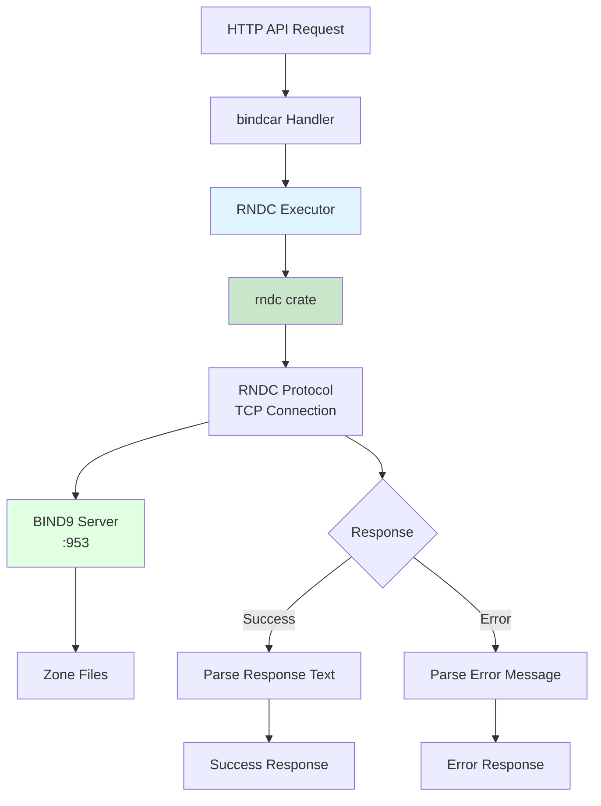
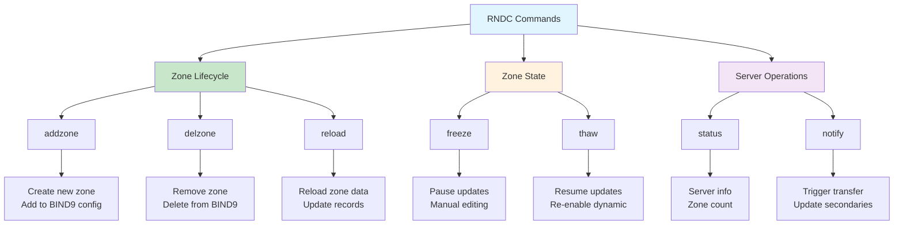
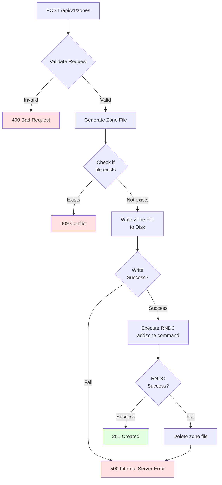
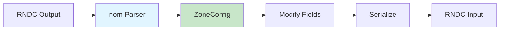

# RNDC Integration

bindcar integrates with BIND9 through the native RNDC (Remote Name Daemon Control) protocol to manage DNS zones dynamically.

## Architecture Overview



## RNDC Command Execution

### Native Protocol Model

bindcar communicates with BIND9 using the native RNDC protocol via the `rndc` crate:

```rust
use rndc::RndcClient;

pub struct RndcExecutor {
    client: RndcClient,
}

impl RndcExecutor {
    pub fn new(server: String, algorithm: String, secret: String) -> Result<Self> {
        let client = RndcClient::new(&server, &algorithm, &secret);
        Ok(Self { client })
    }

    async fn execute(&self, command: &str) -> Result<String> {
        let result = tokio::task::spawn_blocking({
            let client = self.client.clone();
            let command = command.to_string();
            move || client.rndc_command(&command)
        }).await?;

        match result {
            Ok(rndc_result) => {
                if let Some(err) = &rndc_result.err {
                    return Err(anyhow::anyhow!("RNDC command failed: {}", err));
                }
                Ok(rndc_result.text.unwrap_or_default())
            }
            Err(e) => Err(anyhow::anyhow!("RNDC command failed: {}", e))
        }
    }
}
```

### Key Characteristics

- **Native Protocol** - Direct RNDC protocol communication, no subprocess overhead
- **Asynchronous** - Non-blocking command execution using tokio spawn_blocking
- **Authenticated** - HMAC-based authentication with configurable algorithms
- **Error Handling** - Structured error responses from BIND9
- **Efficient** - No process spawning, direct TCP communication
- **Configurable** - Supports environment variables or rndc.conf parsing

### Configuration

bindcar can be configured in two ways:

**Option 1: Environment Variables**

```bash
export RNDC_SERVER="127.0.0.1:953"
export RNDC_ALGORITHM="sha256"
export RNDC_SECRET="dGVzdC1zZWNyZXQtaGVyZQ=="
```

Supported algorithms (with or without `hmac-` prefix):
- `md5` / `hmac-md5`
- `sha1` / `hmac-sha1`
- `sha224` / `hmac-sha224`
- `sha256` / `hmac-sha256`
- `sha384` / `hmac-sha384`
- `sha512` / `hmac-sha512`

**Option 2: Automatic rndc.conf Parsing**

If `RNDC_SECRET` is not set, bindcar automatically parses `/etc/bind/rndc.conf` or `/etc/rndc.conf`:

```conf
# /etc/bind/rndc.conf
include "/etc/bind/rndc.key";

options {
    default-server 127.0.0.1;
    default-key "rndc-key";
};
```

The parser supports `include` directives and will automatically load key files:

```conf
# /etc/bind/rndc.key
key "rndc-key" {
    algorithm hmac-sha256;
    secret "dGVzdC1zZWNyZXQtaGVyZQ==";
};
```

## RNDC Commands Used



### addzone

Add a new zone to BIND9 dynamically:

```bash
rndc addzone example.com '{ type primary; file "/var/cache/bind/example.com.zone"; };'
```

**When Used**: POST /api/v1/zones

**Error Scenarios**:
- Zone already exists
- Invalid zone configuration
- Permission denied
- BIND9 not running

### delzone

Remove a zone from BIND9:

```bash
rndc delzone example.com
```

**When Used**: DELETE /api/v1/zones/{name}

**Error Scenarios**:
- Zone does not exist
- Zone is a built-in zone
- Permission denied

### reload

Reload a specific zone:

```bash
rndc reload example.com
```

**When Used**: POST /api/v1/zones/{name}/reload

**Error Scenarios**:
- Zone does not exist
- Zone file syntax error
- Permission denied

### status

Get BIND9 server status:

```bash
rndc status
```

**When Used**: GET /api/v1/server/status

**Returns**:
- BIND9 version
- Number of zones
- Server uptime
- Resource usage

### freeze/thaw

Freeze or thaw dynamic zone updates:

```bash
rndc freeze example.com
rndc thaw example.com
```

**When Used**: 
- POST /api/v1/zones/{name}/freeze
- POST /api/v1/zones/{name}/thaw

**Use Cases**:
- Manual zone file editing
- Backup operations
- Maintenance windows

### notify

Trigger zone transfer to secondary servers:

```bash
rndc notify example.com
```

**When Used**: POST /api/v1/zones/{name}/notify

**Triggers**:
- NOTIFY messages to secondaries
- Zone transfer (AXFR/IXFR)

## Zone File Management

### File Creation Workflow

When a zone is created via API:



### File Creation Steps

1. **Validate Request** - Check zone name, SOA record, NS records, etc.
2. **Generate Zone File** - Create BIND9 format zone file content
3. **Write to Disk** - Save to `BIND_ZONE_DIR/{zone_name}.zone`
4. **Execute addzone** - Register zone with BIND9 via RNDC
5. **Cleanup on Failure** - Remove zone file if RNDC command fails

Example zone file generation:

```bind
$TTL 3600
@       IN      SOA     ns1.example.com. admin.example.com. (
                        2024010101 ; Serial
                        3600       ; Refresh
                        1800       ; Retry
                        604800     ; Expire
                        86400 )    ; Negative TTL

@       IN      NS      ns1.example.com.
@       IN      A       192.0.2.1
```

### File Naming Convention

Zone files are named using the pattern:

```
{zone_name}.zone
```

Examples:
- `example.com.zone`
- `sub.example.com.zone`
- `192.in-addr.arpa.zone`

### Shared Volume Requirements

In sidecar deployments, bindcar and BIND9 must share the zone directory:

```yaml
volumes:
- name: zones
  emptyDir: {}

containers:
- name: bind9
  volumeMounts:
  - name: zones
    mountPath: /var/cache/bind
    
- name: bindcar
  volumeMounts:
  - name: zones
    mountPath: /var/cache/bind
```

## Error Handling

### RNDC Command Failures

bindcar maps RNDC errors to HTTP status codes:

| RNDC Error | HTTP Status | Reason |
|------------|-------------|---------|
| `zone already exists` | 409 Conflict | Zone exists |
| `not found` | 404 Not Found | Zone doesn't exist |
| `permission denied` | 500 Internal Server Error | RNDC permission issue |
| `syntax error` | 500 Internal Server Error | Invalid zone file |
| Connection refused | 500 Internal Server Error | BIND9 not running |

### Error Response Format

```json
{
  "error": "Failed to execute RNDC command",
  "details": "rndc: 'addzone' failed: zone already exists"
}
```

### Logging

RNDC operations are logged at multiple levels:

```json
{
  "level": "info",
  "message": "Executing RNDC command",
  "command": "addzone",
  "zone": "example.com"
}
```

```json
{
  "level": "error",
  "message": "RNDC command failed",
  "command": "addzone",
  "zone": "example.com",
  "error": "zone already exists",
  "exit_code": 1
}
```

## Security Considerations

### RNDC Key Authentication

BIND9 uses `rndc.key` for authentication. In Kubernetes:

```yaml
volumes:
- name: rndc-key
  secret:
    secretName: rndc-key
    
containers:
- name: bind9
  volumeMounts:
  - name: rndc-key
    mountPath: /etc/bind/rndc.key
    subPath: rndc.key
    readOnly: true
    
- name: bindcar
  volumeMounts:
  - name: rndc-key
    mountPath: /etc/bind/rndc.key
    subPath: rndc.key
    readOnly: true
```

### File Permissions

Zone directory must be writable by bindcar:

```yaml
securityContext:
  fsGroup: 101  # bind group
  runAsUser: 101
  runAsNonRoot: true
```

### Command Injection Prevention

bindcar validates all zone names to prevent command injection:

- Alphanumeric characters
- Hyphens
- Dots (for subdomains)
- No shell metacharacters

## Performance Characteristics

### Command Execution Time

Typical RNDC command execution times using native protocol:

- `addzone`: 5-30ms (improved from subprocess approach)
- `delzone`: 5-20ms (improved from subprocess approach)
- `reload`: 3-15ms (improved from subprocess approach)
- `status`: 3-10ms (improved from subprocess approach)

Performance benefits of native protocol:
- No subprocess spawning overhead
- Direct TCP communication
- Efficient binary protocol
- Reduced system call overhead

### Concurrency

bindcar handles multiple concurrent RNDC operations:

- Async/await pattern for non-blocking execution
- Native protocol allows multiple concurrent connections
- No explicit locking required
- BIND9 handles internal synchronization
- `spawn_blocking` prevents blocking the async runtime

### Resource Usage

Native RNDC protocol has minimal overhead:

- No persistent connections (connects per command)
- No subprocess spawning
- Minimal memory footprint
- Direct binary protocol (no stdout/stderr parsing)

## Troubleshooting

### RNDC Connection Issues

**Symptom**: 500 errors, "connection refused" or "Failed to execute RNDC command"

**Causes**:
- BIND9 not running
- BIND9 not listening on port 953
- RNDC key/secret mismatch
- Network connectivity issues
- Incorrect RNDC_SERVER address

**Diagnosis**:
```bash
# Check BIND9 is running
ps aux | grep named

# Check BIND9 is listening on port 953
netstat -tuln | grep 953
# or
ss -tuln | grep 953

# Verify RNDC configuration
cat /etc/bind/rndc.conf

# Test connectivity to RNDC port
nc -zv 127.0.0.1 953

# Check bindcar logs for RNDC errors
docker logs bindcar | grep -i rndc
```

### Permission Errors

**Symptom**: 500 errors, "permission denied"

**Causes**:
- Zone directory not writable
- RNDC key not readable
- SELinux/AppArmor restrictions

**Diagnosis**:
```bash
# Check directory permissions
ls -la /var/cache/bind

# Check RNDC key permissions
ls -la /etc/bind/rndc.key

# Test writing to zone directory
touch /var/cache/bind/test.txt
```

### Zone File Syntax Errors

**Symptom**: Reload fails with syntax error

**Causes**:
- Invalid DNS record format
- Missing SOA record
- Invalid TTL values

**Diagnosis**:
```bash
# Check zone file syntax
named-checkzone example.com /var/cache/bind/db.example.com

# View recent logs
tail -f /var/log/syslog | grep named
```

## RNDC Output Parsing

bindcar includes comprehensive parsers for RNDC command outputs using the `nom` parser combinator library. This enables structured parsing of BIND9 responses for reliable zone configuration management.

### Parser Architecture



### Supported Commands

#### showzone Parser

Parses `rndc showzone <zone>` output into structured `ZoneConfig`:

```rust
use bindcar::rndc_parser::parse_showzone;

let output = r#"zone "example.com" {
    type primary;
    file "/var/cache/bind/example.com.zone";
    allow-transfer { 10.0.0.1/32; 10.0.0.2/32; };
    also-notify { 10.0.0.1; 10.0.0.2; };
};"#;

let config = parse_showzone(output)?;
assert_eq!(config.zone_name, "example.com");
assert_eq!(config.zone_type, ZoneType::Primary);
```

**Supported Fields**:
- `zone_name` - Zone domain name
- `zone_type` - Primary, Secondary, Stub, Forward, Hint, Mirror, Delegation, Redirect
- `class` - IN, CH, HS (default: IN)
- `file` - Zone file path
- `primaries` - Primary server IPs with optional ports (for secondary zones)
- `also-notify` - IPs to notify on zone changes
- `allow-transfer` - IPs allowed to transfer the zone
- `allow-update` - IPs allowed to update the zone (key references ignored)

### CIDR Notation Support

The parser automatically handles CIDR notation in IP address lists:

```rust
// Input from BIND9
let input = r#"zone "internal.local" {
    type primary;
    allow-transfer { 10.244.1.18/32; 10.244.1.21/32; };
};"#;

let config = parse_showzone(input)?;

// CIDR suffix is stripped, only IP addresses extracted
assert_eq!(config.allow_transfer.unwrap(), vec![
    "10.244.1.18".parse::<IpAddr>()?,
    "10.244.1.21".parse::<IpAddr>()?,
]);
```

**Why CIDR Stripping?**
- BIND9 outputs CIDR notation (`/32`, `/128`) in ACLs
- bindcar stores only IP addresses for simplicity
- CIDR information is not needed for zone modification
- Reduces complexity in zone configuration updates

### Key-Based Access Control

The parser handles key-based `allow-update` directives:

```rust
// Input with TSIG key reference
let input = r#"zone "example.com" {
    type primary;
    allow-update { key "update-key"; };
};"#;

let config = parse_showzone(input)?;

// Key references are ignored, only IP addresses extracted
assert_eq!(config.allow_update, Some(vec![])); // Empty - no IPs
```

**Rationale**:
- TSIG keys managed separately from zone configuration
- bindcar focuses on IP-based ACLs for API operations
- Key-based updates use BIND9's existing TSIG infrastructure
- Prevents accidental modification of key-based permissions

### Zone Type Support

Parser accepts both modern and legacy BIND9 terminology:

| Modern | Legacy | ZoneType |
|--------|--------|----------|
| `primary` | `master` | Primary |
| `secondary` | `slave` | Secondary |
| `stub` | `stub` | Stub |
| `forward` | `forward` | Forward |
| `hint` | `hint` | Hint |
| `mirror` | `mirror` | Mirror |
| `delegation-only` | `delegation-only` | Delegation |
| `redirect` | `redirect` | Redirect |

```rust
// Both formats are accepted
parse_showzone(r#"zone "a.com" { type master; };"#)?; // Legacy
parse_showzone(r#"zone "b.com" { type primary; };"#)?; // Modern
```

### Round-Trip Serialization

Zone configurations can be parsed, modified, and serialized back to RNDC format:

```rust
use bindcar::rndc_parser::parse_showzone;

// 1. Parse BIND9 output
let output = rndc_executor.showzone("example.com").await?;
let mut config = parse_showzone(&output)?;

// 2. Modify configuration
config.also_notify = Some(vec![
    "10.0.0.3".parse()?,
    "10.0.0.4".parse()?,
]);

// 3. Serialize back to RNDC format
let rndc_block = config.to_rndc_block();
// Output: "{ type primary; file "..."; also-notify { 10.0.0.3; 10.0.0.4; }; };"

// 4. Update zone in BIND9
rndc_executor.modzone("example.com", &rndc_block).await?;
```

### Error Handling

Parser provides detailed error messages:

```rust
use bindcar::rndc_parser::{parse_showzone, RndcParseError};

match parse_showzone(invalid_input) {
    Ok(config) => { /* Use config */ },
    Err(RndcParseError::ParseError(msg)) => {
        eprintln!("Parse failed: {}", msg);
    },
    Err(RndcParseError::InvalidZoneType(type_str)) => {
        eprintln!("Unknown zone type: {}", type_str);
    },
    Err(RndcParseError::InvalidIpAddress(addr)) => {
        eprintln!("Invalid IP address: {}", addr);
    },
    Err(RndcParseError::MissingField(field)) => {
        eprintln!("Required field missing: {}", field);
    },
    Err(RndcParseError::Incomplete) => {
        eprintln!("Incomplete input");
    },
}
```

### Parser Implementation

The parser uses `nom` combinators for robust parsing:

```rust
// Primitive parsers
fn quoted_string(input: &str) -> IResult<&str, String>
fn identifier(input: &str) -> IResult<&str, &str>
fn ip_addr(input: &str) -> IResult<&str, IpAddr>
fn ip_with_port(input: &str) -> IResult<&str, PrimarySpec>

// Zone statement parsers
fn parse_type_statement(input: &str) -> IResult<&str, ZoneStatement>
fn parse_file_statement(input: &str) -> IResult<&str, ZoneStatement>
fn parse_primaries_statement(input: &str) -> IResult<&str, ZoneStatement>
fn parse_also_notify_statement(input: &str) -> IResult<&str, ZoneStatement>
fn parse_allow_transfer_statement(input: &str) -> IResult<&str, ZoneStatement>
fn parse_allow_update_statement(input: &str) -> IResult<&str, ZoneStatement>

// Top-level parser
pub fn parse_showzone(input: &str) -> ParseResult<ZoneConfig>
```

### Use Cases

**Zone Modification (PATCH /api/v1/zones/{name})**:
```rust
// Get current configuration
let output = state.rndc.showzone(&zone_name).await?;
let mut config = parse_showzone(&output)?;

// Update fields from API request
if let Some(also_notify) = request.also_notify {
    config.also_notify = Some(also_notify);
}

// Apply changes
let rndc_block = config.to_rndc_block();
state.rndc.modzone(&zone_name, &rndc_block).await?;
```

**Zone Inspection**:
```rust
// Parse zone configuration
let output = rndc_executor.showzone("example.com").await?;
let config = parse_showzone(&output)?;

// Inspect zone details
println!("Zone: {}", config.zone_name);
println!("Type: {}", config.zone_type.as_str());
println!("File: {:?}", config.file);
println!("Notify: {:?}", config.also_notify);
```

### Testing

The parser includes comprehensive test coverage:

```rust
#[test]
fn test_parse_real_world_output() {
    let input = r#"zone "internal.local" {
        type primary;
        file "/var/cache/bind/internal.local.zone";
        allow-transfer { 10.244.1.18/32; 10.244.1.21/32; };
        allow-update { key "bindy-operator"; };
        also-notify { 10.244.1.18; 10.244.1.21; };
    };"#;

    let config = parse_showzone(input).unwrap();

    assert_eq!(config.zone_name, "internal.local");
    assert_eq!(config.zone_type, ZoneType::Primary);
    assert_eq!(config.allow_transfer.unwrap().len(), 2);
    assert_eq!(config.also_notify.unwrap().len(), 2);
}

#[test]
fn test_parse_ip_addr_with_cidr() {
    assert_eq!(
        ip_addr("192.168.1.1/32").unwrap().1,
        "192.168.1.1".parse::<IpAddr>().unwrap()
    );
}
```

### Limitations

**Not Currently Parsed**:
- Views and ACL names (e.g., `allow-transfer { "trusted"; };`)
- Complex ACL expressions (e.g., `{ !10.0.0.1; any; }`)
- Key definitions (only references are skipped)
- Custom zone options beyond documented fields

**Future Enhancements**:
- Parser for `rndc zonestatus` output
- Parser for `rndc status` output
- Parser for `rndc.conf` files (see [roadmap](../../roadmaps/rndc-conf-parser.md))
- Support for ACL names and expressions

## Best Practices

1. **Validate Early** - Validate zone data before executing RNDC commands
2. **Log Everything** - Log all RNDC operations for audit trail
3. **Handle Errors Gracefully** - Provide clear error messages to API clients
4. **Monitor RNDC Health** - Use `/api/v1/server/status` to monitor BIND9
5. **Use Timeouts** - Set reasonable timeouts for RNDC command execution
6. **Share Volumes Correctly** - Ensure BIND9 and bindcar can both access zone files
7. **Secure RNDC Keys** - Use Kubernetes secrets for rndc.key in production
8. **Parse Before Modify** - Always parse showzone output before modifying zones
9. **Test Parser Changes** - Validate parser against real BIND9 output

## Next Steps

- [API Reference](../api-reference/index.md) - Complete API documentation
- [Troubleshooting](../troubleshooting.md) - Common issues and solutions
- [Examples](../examples.md) - Practical use cases
- [RNDC Parser Roadmap](../../roadmaps/rndc-conf-parser.md) - Future parser enhancements
