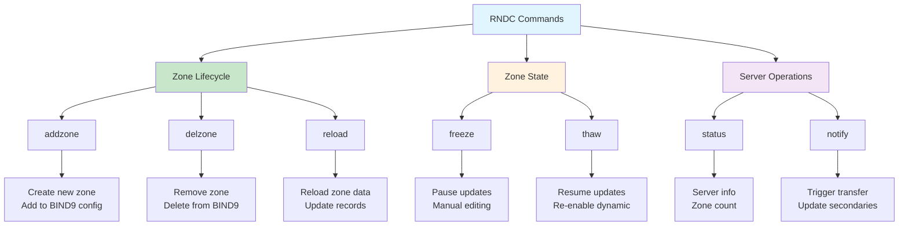
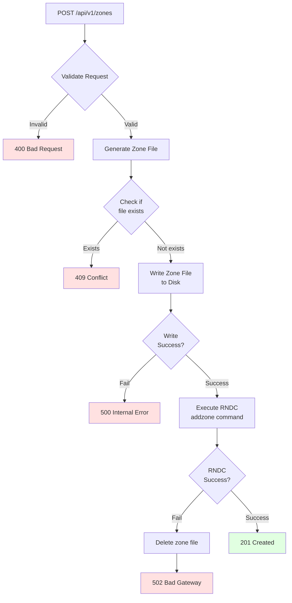

# RNDC Integration

bindcar integrates with BIND9 through the RNDC (Remote Name Daemon Control) protocol to manage DNS zones dynamically.

## Architecture Overview

```mermaid
graph TD
    A[HTTP API Request] --> B[bindcar Handler]
    B --> C[RNDC Executor]
    C --> D[tokio::process::Command]
    D --> E[/usr/sbin/rndc]
    E --> F[BIND9 Server]
    F --> G[Zone Files]
    
    E --> H{Exit Code}
    H -->|0| I[Parse stdout]
    H -->|!=0| J[Parse stderr]
    I --> K[Success Response]
    J --> L[Error Response]
    
    style C fill:#e1f5ff
    style E fill:#ffe1e1
    style F fill:#e1ffe1
```

## RNDC Command Execution

### Process Model

bindcar executes RNDC commands using Rust's async `tokio::process::Command`:

```rust
use tokio::process::Command;

async fn execute_rndc(args: &[&str]) -> Result<String, String> {
    let output = Command::new("/usr/sbin/rndc")
        .args(args)
        .output()
        .await?;
    
    if output.status.success() {
        Ok(String::from_utf8_lossy(&output.stdout).to_string())
    } else {
        Err(String::from_utf8_lossy(&output.stderr).to_string())
    }
}
```

### Key Characteristics

- **Asynchronous** - Non-blocking command execution using tokio
- **Isolated** - Each command runs in a separate process
- **Timeout Protected** - Commands have execution timeouts
- **Error Handling** - Captures both stdout and stderr
- **Status Code Aware** - Exit code determines success/failure

## RNDC Commands Used



### addzone

Add a new zone to BIND9 dynamically:

```bash
rndc addzone example.com '{ type master; file "/var/cache/bind/db.example.com"; };'
```

**When Used**: POST /api/v1/zones

**Error Scenarios**:
- Zone already exists
- Invalid zone configuration
- Permission denied
- BIND9 not running

### delzone

Remove a zone from BIND9:

```bash
rndc delzone example.com
```

**When Used**: DELETE /api/v1/zones/{name}

**Error Scenarios**:
- Zone does not exist
- Zone is a built-in zone
- Permission denied

### reload

Reload a specific zone:

```bash
rndc reload example.com
```

**When Used**: POST /api/v1/zones/{name}/reload

**Error Scenarios**:
- Zone does not exist
- Zone file syntax error
- Permission denied

### status

Get BIND9 server status:

```bash
rndc status
```

**When Used**: GET /api/v1/server/status

**Returns**:
- BIND9 version
- Number of zones
- Server uptime
- Resource usage

### freeze/thaw

Freeze or thaw dynamic zone updates:

```bash
rndc freeze example.com
rndc thaw example.com
```

**When Used**: 
- POST /api/v1/zones/{name}/freeze
- POST /api/v1/zones/{name}/thaw

**Use Cases**:
- Manual zone file editing
- Backup operations
- Maintenance windows

### notify

Trigger zone transfer to secondary servers:

```bash
rndc notify example.com
```

**When Used**: POST /api/v1/zones/{name}/notify

**Triggers**:
- NOTIFY messages to secondaries
- Zone transfer (AXFR/IXFR)

## Zone File Management

### File Creation Workflow

When a zone is created via API:



### File Creation Steps

1. **Validate Request** - Check zone name, SOA record, NS records, etc.
2. **Generate Zone File** - Create BIND9 format zone file content
3. **Write to Disk** - Save to `BIND_ZONE_DIR/db.{zone_name}`
4. **Execute addzone** - Register zone with BIND9 via RNDC
5. **Cleanup on Failure** - Remove zone file if RNDC command fails

Example zone file generation:

```bind
$TTL 3600
@       IN      SOA     ns1.example.com. admin.example.com. (
                        2024010101 ; Serial
                        3600       ; Refresh
                        1800       ; Retry
                        604800     ; Expire
                        86400 )    ; Negative TTL

@       IN      NS      ns1.example.com.
@       IN      A       192.0.2.1
```

### File Naming Convention

Zone files are named using the pattern:

```
db.{zone_name}
```

Examples:
- `db.example.com`
- `db.sub.example.com`
- `db.192.in-addr.arpa`

### Shared Volume Requirements

In sidecar deployments, bindcar and BIND9 must share the zone directory:

```yaml
volumes:
- name: zones
  emptyDir: {}

containers:
- name: bind9
  volumeMounts:
  - name: zones
    mountPath: /var/cache/bind
    
- name: bindcar
  volumeMounts:
  - name: zones
    mountPath: /var/cache/bind
```

## Error Handling

### RNDC Command Failures

bindcar maps RNDC errors to HTTP status codes:

| RNDC Error | HTTP Status | Reason |
|------------|-------------|---------|
| `zone already exists` | 409 Conflict | Zone exists |
| `not found` | 404 Not Found | Zone doesn't exist |
| `permission denied` | 502 Bad Gateway | RNDC permission issue |
| `syntax error` | 502 Bad Gateway | Invalid zone file |
| Connection refused | 502 Bad Gateway | BIND9 not running |

### Error Response Format

```json
{
  "error": "Failed to execute RNDC command",
  "details": "rndc: 'addzone' failed: zone already exists"
}
```

### Logging

RNDC operations are logged at multiple levels:

```json
{
  "level": "info",
  "message": "Executing RNDC command",
  "command": "addzone",
  "zone": "example.com"
}
```

```json
{
  "level": "error",
  "message": "RNDC command failed",
  "command": "addzone",
  "zone": "example.com",
  "error": "zone already exists",
  "exit_code": 1
}
```

## Security Considerations

### RNDC Key Authentication

BIND9 uses `rndc.key` for authentication. In Kubernetes:

```yaml
volumes:
- name: rndc-key
  secret:
    secretName: rndc-key
    
containers:
- name: bind9
  volumeMounts:
  - name: rndc-key
    mountPath: /etc/bind/rndc.key
    subPath: rndc.key
    readOnly: true
    
- name: bindcar
  volumeMounts:
  - name: rndc-key
    mountPath: /etc/bind/rndc.key
    subPath: rndc.key
    readOnly: true
```

### File Permissions

Zone directory must be writable by bindcar:

```yaml
securityContext:
  fsGroup: 101  # bind group
  runAsUser: 101
  runAsNonRoot: true
```

### Command Injection Prevention

bindcar validates all zone names to prevent command injection:

- Alphanumeric characters
- Hyphens
- Dots (for subdomains)
- No shell metacharacters

## Performance Characteristics

### Command Execution Time

Typical RNDC command execution times:

- `addzone`: 10-50ms
- `delzone`: 10-30ms
- `reload`: 5-20ms
- `status`: 5-15ms

### Concurrency

bindcar handles multiple concurrent RNDC operations:

- Async/await pattern for non-blocking execution
- No explicit locking required
- BIND9 handles internal synchronization

### Resource Usage

RNDC commands have minimal overhead:

- No persistent connections
- Process spawning via tokio
- Stdout/stderr captured in memory

## Troubleshooting

### RNDC Connection Issues

**Symptom**: 502 errors, "connection refused"

**Causes**:
- BIND9 not running
- RNDC key mismatch
- BIND9 not listening on expected socket

**Diagnosis**:
```bash
# Check BIND9 is running
ps aux | grep named

# Test RNDC manually
rndc status

# Check RNDC configuration
cat /etc/bind/rndc.conf
```

### Permission Errors

**Symptom**: 502 errors, "permission denied"

**Causes**:
- Zone directory not writable
- RNDC key not readable
- SELinux/AppArmor restrictions

**Diagnosis**:
```bash
# Check directory permissions
ls -la /var/cache/bind

# Check RNDC key permissions
ls -la /etc/bind/rndc.key

# Test writing to zone directory
touch /var/cache/bind/test.txt
```

### Zone File Syntax Errors

**Symptom**: Reload fails with syntax error

**Causes**:
- Invalid DNS record format
- Missing SOA record
- Invalid TTL values

**Diagnosis**:
```bash
# Check zone file syntax
named-checkzone example.com /var/cache/bind/db.example.com

# View recent logs
tail -f /var/log/syslog | grep named
```

## Best Practices

1. **Validate Early** - Validate zone data before executing RNDC commands
2. **Log Everything** - Log all RNDC operations for audit trail
3. **Handle Errors Gracefully** - Provide clear error messages to API clients
4. **Monitor RNDC Health** - Use `/api/v1/server/status` to monitor BIND9
5. **Use Timeouts** - Set reasonable timeouts for RNDC command execution
6. **Share Volumes Correctly** - Ensure BIND9 and bindcar can both access zone files
7. **Secure RNDC Keys** - Use Kubernetes secrets for rndc.key in production

## Next Steps

- [API Reference](../api-reference/index.md) - Complete API documentation
- [Troubleshooting](../troubleshooting.md) - Common issues and solutions
- [Examples](../examples.md) - Practical use cases
