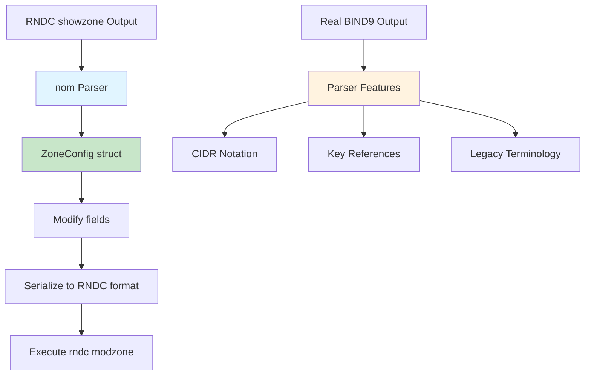

# RNDC Parser

The RNDC parser provides structured parsing of BIND9 RNDC command outputs using the `nom` parser combinator library. This enables reliable parsing and manipulation of zone configurations.

## Overview

bindcar includes parsers for RNDC command outputs to enable structured zone configuration management:

- **Parse** - Convert RNDC text output to structured Rust types
- **Modify** - Update zone configuration programmatically
- **Serialize** - Convert back to RNDC format for execution
- **Validate** - Ensure configuration correctness

## Architecture


```mermaid
graph TD
    A[RNDC showzone Output] --> B[nom Parser]
    B --> C[ZoneConfig struct]
    C --> D[Modify fields]
    D --> E[Serialize to RNDC format]
    E --> F[Execute rndc modzone]

    G[Real BIND9 Output] --> H[Parser Features]
    H --> I[CIDR Notation]
    H --> J[Key References]
    H --> K[Legacy Terminology]

    style B fill:#e1f5ff
    style C fill:#c8e6c9
    style H fill:#fff3e0
```

## Supported Commands

### showzone

Parse `rndc showzone <zone>` output:

```rust
use bindcar::rndc_parser::parse_showzone;

let output = r#"zone "example.com" {
    type primary;
    file "/var/cache/bind/example.com.zone";
    allow-transfer { 10.0.0.1/32; 10.0.0.2/32; };
    also-notify { 10.0.0.1; 10.0.0.2; };
};"#;

let config = parse_showzone(output)?;
println!("Zone: {}", config.zone_name); // example.com
println!("Type: {:?}", config.zone_type); // Primary
println!("Transfer ACL: {:?}", config.allow_transfer); // [10.0.0.1, 10.0.0.2]
```

## Data Structures

### ZoneConfig

Primary data structure representing a BIND9 zone configuration:

```rust
pub struct ZoneConfig {
    // Core fields
    pub zone_name: String,
    pub class: DnsClass,
    pub zone_type: ZoneType,
    pub file: Option<String>,

    // Primary/Secondary options
    pub primaries: Option<Vec<PrimarySpec>>,
    pub also_notify: Option<Vec<IpAddr>>,
    pub notify: Option<NotifyMode>,

    // Access Control options
    pub allow_query: Option<Vec<IpAddr>>,
    pub allow_transfer: Option<Vec<IpAddr>>,
    pub allow_update: Option<Vec<IpAddr>>,
    pub allow_update_raw: Option<String>,        // Raw directive (e.g., key references)
    pub allow_update_forwarding: Option<Vec<IpAddr>>,
    pub allow_notify: Option<Vec<IpAddr>>,

    // Transfer Control options
    pub max_transfer_time_in: Option<u32>,
    pub max_transfer_time_out: Option<u32>,
    pub max_transfer_idle_in: Option<u32>,
    pub max_transfer_idle_out: Option<u32>,
    pub transfer_source: Option<IpAddr>,
    pub transfer_source_v6: Option<IpAddr>,
    pub alt_transfer_source: Option<IpAddr>,
    pub alt_transfer_source_v6: Option<IpAddr>,

    // Dynamic Update options
    pub update_policy: Option<String>,           // Raw directive
    pub sig_validity_interval: Option<u32>,
    pub sig_signing_signatures: Option<u32>,

    // DNSSEC options
    pub auto_dnssec: Option<AutoDnssecMode>,
    pub dnssec_dnskey_kskonly: Option<bool>,
    pub dnssec_loadkeys_interval: Option<u32>,
    pub dnssec_update_mode: Option<String>,
    pub inline_signing: Option<bool>,

    // Forwarding options
    pub forwarders: Option<Vec<ForwarderSpec>>,
    pub forward: Option<ForwardMode>,

    // Zone Maintenance options
    pub max_journal_size: Option<String>,
    pub max_records: Option<u32>,
    pub max_zone_ttl: Option<u32>,
    pub serial_update_method: Option<String>,
    pub zone_statistics: Option<String>,

    // Refresh/Retry options
    pub max_refresh_time: Option<u32>,
    pub min_refresh_time: Option<u32>,
    pub max_retry_time: Option<u32>,
    pub min_retry_time: Option<u32>,

    // Miscellaneous options
    pub check_names: Option<CheckNamesMode>,
    pub masterfile_format: Option<MasterfileFormat>,
    pub masterfile_style: Option<String>,

    // Generic catch-all for unrecognized options
    pub raw_options: HashMap<String, String>,
}
```

**Note**: All new fields added in v0.6.0+ are optional (`Option<T>`) for backward compatibility. The `raw_options` HashMap preserves any BIND9 options not explicitly modeled.

### ZoneType

Supported zone types:

```rust
pub enum ZoneType {
    Primary,      // Authoritative primary zone (formerly "master")
    Secondary,    // Secondary zone (formerly "slave")
    Stub,         // Stub zone
    Forward,      // Forward zone
    Hint,         // Hint zone (root servers)
    Mirror,       // Mirror zone
    Delegation,   // Delegation-only zone
    Redirect,     // Redirect zone
}
```

### PrimarySpec

Primary server specification for secondary zones:

```rust
pub struct PrimarySpec {
    pub address: IpAddr,      // Primary server IP
    pub port: Option<u16>,    // Custom port (default: 53)
}
```

### ForwarderSpec

Forwarder specification for forward zones:

```rust
pub struct ForwarderSpec {
    pub address: IpAddr,
    pub port: Option<u16>,
    pub tls_config: Option<String>,
}
```

### NotifyMode

NOTIFY mode for zone transfer notifications:

```rust
pub enum NotifyMode {
    Yes,          // Send NOTIFY to all NS records and also-notify list
    No,           // Do not send NOTIFY
    Explicit,     // Send NOTIFY only to also-notify list
    MasterOnly,   // Send NOTIFY only from primary servers (legacy term)
    PrimaryOnly,  // Send NOTIFY only from primary servers (modern term)
}
```

### ForwardMode

Forwarding mode for forward zones:

```rust
pub enum ForwardMode {
    Only,   // Forward queries and do not attempt direct resolution
    First,  // Forward queries, fall back to direct resolution if no answer
}
```

### AutoDnssecMode

Automatic DNSSEC signing mode:

```rust
pub enum AutoDnssecMode {
    Off,       // DNSSEC signing disabled
    Maintain,  // Maintain existing signatures
    Create,    // Create new signatures automatically
}
```

### CheckNamesMode

Check-names policy for zone data validation:

```rust
pub enum CheckNamesMode {
    Fail,    // Reject zones with invalid names
    Warn,    // Accept but log warnings
    Ignore,  // Accept without warnings
}
```

### MasterfileFormat

Zone file format:

```rust
pub enum MasterfileFormat {
    Text,  // Standard text format
    Raw,   // Binary format (faster loading)
    Map,   // Memory-mapped format
}
```

## Parser Features

### CIDR Notation Handling

BIND9 outputs CIDR notation in ACLs, which the parser automatically strips:

```rust
// BIND9 output includes CIDR
let input = r#"zone "internal.local" {
    allow-transfer { 10.244.1.18/32; 10.244.1.21/32; };
};"#;

let config = parse_showzone(input)?;

// Parser extracts IP addresses only
assert_eq!(config.allow_transfer, Some(vec![
    "10.244.1.18".parse()?,
    "10.244.1.21".parse()?,
]));
```

**Why strip CIDR?**
- bindcar manages IP addresses, not subnet masks
- CIDR information not needed for zone modification
- Simplifies zone configuration updates
- BIND9 automatically adds `/32` (IPv4) or `/128` (IPv6) when missing

### Key-Based Access Control

The parser handles TSIG key references in `allow-update`:

```rust
let input = r#"zone "example.com" {
    allow-update { key "update-key"; };
};"#;

let config = parse_showzone(input)?;

// Key references ignored - only IP addresses extracted
assert_eq!(config.allow_update, Some(vec![])); // Empty
```

**Rationale**:
- TSIG keys managed separately from zone config
- bindcar API focuses on IP-based ACLs
- Prevents accidental modification of key-based permissions
- Key-based updates use BIND9's native TSIG infrastructure

### Legacy Terminology Support

Parser accepts both modern and legacy BIND9 zone type names:

```rust
// Modern terminology (BIND 9.16+)
parse_showzone(r#"zone "a.com" { type primary; };"#)?;
parse_showzone(r#"zone "b.com" { type secondary; };"#)?;

// Legacy terminology (BIND 9.15 and earlier)
parse_showzone(r#"zone "c.com" { type master; };"#)?;
parse_showzone(r#"zone "d.com" { type slave; };"#)?;
```

| Modern Term | Legacy Term | Enum Value |
|-------------|-------------|------------|
| `primary` | `master` | `ZoneType::Primary` |
| `secondary` | `slave` | `ZoneType::Secondary` |

**Benefits**:
- Works with all BIND9 versions
- Gradual migration to modern terminology
- No breaking changes when upgrading BIND9

### Port Number Support

Primary server specifications can include custom ports:

```rust
let input = r#"zone "example.org" {
    type secondary;
    primaries { 192.0.2.1; 192.0.2.2 port 5353; };
};"#;

let config = parse_showzone(input)?;

assert_eq!(config.primaries, Some(vec![
    PrimarySpec { address: "192.0.2.1".parse()?, port: None },
    PrimarySpec { address: "192.0.2.2".parse()?, port: Some(5353) },
]));
```

## Enhanced Features (v0.6.0+)

### Unknown Option Preservation

The parser includes a catch-all mechanism that preserves all unknown BIND9 zone options:

```rust
let input = r#"zone "example.com" {
    type primary;
    file "/var/cache/bind/example.com.zone";
    zone-statistics full;
    max-zone-ttl 86400;
    custom-option "custom-value";
};"#;

let config = parse_showzone(input)?;

// Unknown options preserved in raw_options HashMap
assert_eq!(config.raw_options.get("zone-statistics"), Some(&"full".to_string()));
assert_eq!(config.raw_options.get("max-zone-ttl"), Some(&"86400".to_string()));
assert_eq!(config.raw_options.get("custom-option"), Some(&"\"custom-value\"".to_string()));

// Serialization preserves all options
let serialized = config.to_rndc_block();
assert!(serialized.contains("zone-statistics full"));
assert!(serialized.contains("max-zone-ttl 86400"));
assert!(serialized.contains("custom-option \"custom-value\""));
```

**Benefits:**
- **Future-Proof**: New BIND9 options automatically supported without code changes
- **No Data Loss**: Complete round-trip preservation of all configuration
- **Graceful Degradation**: Unrecognized options preserved verbatim
- **BIND9 Compatibility**: Works across all BIND9 versions

### Block-Style Option Preservation

The parser handles complex block-style options:

```rust
let input = r#"zone "example.com" {
    type primary;
    update-policy { grant example.com. zonesub any; };
    acl-list { 10.0.0.0/8; 192.168.0.0/16; };
};"#;

let config = parse_showzone(input)?;

// Block-style options preserved with full syntax
assert!(config.raw_options.contains_key("update-policy"));
let update_policy = config.raw_options.get("update-policy").unwrap();
assert!(update_policy.contains("grant"));
assert!(update_policy.contains("zonesub"));
```

### Comprehensive Zone Configuration

Parse zones with 30+ structured fields plus catch-all:

```rust
let input = r#"zone "internal.local" {
    type primary;
    file "/var/cache/bind/internal.local.zone";

    // Access control
    allow-transfer { 10.244.1.18/32; 10.244.1.21/32; };
    allow-update { key "bindy-operator"; };
    also-notify { 10.244.1.18; 10.244.1.21; };
    notify yes;

    // DNSSEC
    auto-dnssec maintain;
    inline-signing yes;

    // Transfer control
    max-transfer-time-in 3600;

    // Zone maintenance
    max-zone-ttl 86400;
    zone-statistics full;

    // Custom options
    custom-bind-option "value";
};"#;

let config = parse_showzone(input)?;

// Structured fields
assert_eq!(config.zone_type, ZoneType::Primary);
assert_eq!(config.notify, Some(NotifyMode::Yes));
assert_eq!(config.auto_dnssec, Some(AutoDnssecMode::Maintain));
assert_eq!(config.inline_signing, Some(true));
assert_eq!(config.max_transfer_time_in, Some(3600));
assert_eq!(config.max_zone_ttl, Some(86400));

// Raw directive preserved
assert!(config.allow_update_raw.is_some());
assert!(config.allow_update_raw.unwrap().contains("key"));

// Unknown options preserved
assert_eq!(config.raw_options.get("zone-statistics"), Some(&"full".to_string()));
assert_eq!(config.raw_options.get("custom-bind-option"), Some(&"\"value\"".to_string()));
```

**Supported Structured Fields (30+)**:

**Access Control**: `allow-query`, `allow-transfer`, `allow-update`, `allow-update-forwarding`, `allow-notify`

**Transfer Control**: `max-transfer-time-in`, `max-transfer-time-out`, `max-transfer-idle-in`, `max-transfer-idle-out`, `transfer-source`, `transfer-source-v6`, `alt-transfer-source`, `alt-transfer-source-v6`

**DNSSEC**: `auto-dnssec`, `dnssec-dnskey-kskonly`, `dnssec-loadkeys-interval`, `dnssec-update-mode`, `inline-signing`

**Forwarding**: `forwarders`, `forward`

**Zone Maintenance**: `max-journal-size`, `max-records`, `max-zone-ttl`, `serial-update-method`, `zone-statistics`

**Refresh/Retry**: `max-refresh-time`, `min-refresh-time`, `max-retry-time`, `min-retry-time`

**Miscellaneous**: `check-names`, `masterfile-format`, `masterfile-style`, `notify`, `update-policy`, `sig-validity-interval`, `sig-signing-signatures`

## Round-Trip Serialization

Parse, modify, and serialize zone configurations:

```rust
// 1. Parse current configuration
let output = rndc_executor.showzone("example.com").await?;
let mut config = parse_showzone(&output)?;

// 2. Modify fields
config.also_notify = Some(vec![
    "10.0.0.3".parse()?,
    "10.0.0.4".parse()?,
]);

config.allow_transfer = Some(vec![
    "10.0.0.3".parse()?,
    "10.0.0.4".parse()?,
]);

// 3. Serialize to RNDC format
let rndc_block = config.to_rndc_block();
// Result: "{ type primary; file \"...\"; also-notify { 10.0.0.3; 10.0.0.4; }; allow-transfer { 10.0.0.3; 10.0.0.4; }; };"

// 4. Apply changes via RNDC
rndc_executor.modzone("example.com", &rndc_block).await?;
```

## Error Handling

### Parser Errors

The parser provides structured error types:

```rust
pub enum RndcParseError {
    ParseError(String),           // General parse failure
    InvalidZoneType(String),      // Unknown zone type
    InvalidDnsClass(String),      // Unknown DNS class
    InvalidIpAddress(String),     // Invalid IP address format
    MissingField(String),         // Required field missing
    Incomplete,                   // Incomplete input
}
```

### Error Messages

```rust
use bindcar::rndc_parser::{parse_showzone, RndcParseError};

match parse_showzone(input) {
    Ok(config) => {
        println!("Parsed zone: {}", config.zone_name);
    },
    Err(RndcParseError::ParseError(msg)) => {
        eprintln!("Parse failed: {}", msg);
    },
    Err(RndcParseError::InvalidZoneType(type_str)) => {
        eprintln!("Unknown zone type: {}", type_str);
    },
    Err(RndcParseError::InvalidIpAddress(addr)) => {
        eprintln!("Invalid IP: {}", addr);
    },
    Err(e) => {
        eprintln!("Parser error: {}", e);
    },
}
```

## Use Cases

### Zone Modification API

The PATCH endpoint uses the parser to update zone configurations:

```rust
// src/zones.rs - modify_zone() function

// Get current configuration from BIND9
let showzone_output = state.rndc.showzone(&zone_name).await?;
let mut zone_config = parse_showzone(&showzone_output)?;

// Update fields from API request
if let Some(also_notify) = &request.also_notify {
    zone_config.also_notify = Some(also_notify.clone());
}

if let Some(allow_transfer) = &request.allow_transfer {
    zone_config.allow_transfer = Some(allow_transfer.clone());
}

// Serialize and apply changes
let rndc_block = zone_config.to_rndc_block();
state.rndc.modzone(&zone_name, &rndc_block).await?;
```

### Zone Inspection

```rust
// Fetch and parse zone configuration
let output = rndc_executor.showzone("example.com").await?;
let config = parse_showzone(&output)?;

// Inspect configuration
println!("Zone: {}", config.zone_name);
println!("Type: {:?}", config.zone_type);
println!("File: {:?}", config.file);
println!("Class: {:?}", config.class);

if let Some(primaries) = &config.primaries {
    println!("Primary servers:");
    for primary in primaries {
        match primary.port {
            Some(port) => println!("  {} port {}", primary.address, port),
            None => println!("  {}", primary.address),
        }
    }
}
```

## Testing

### Unit Tests

The parser includes comprehensive test coverage:

```rust
#[test]
fn test_parse_ip_addr_with_cidr() {
    // Test CIDR notation stripping
    assert_eq!(
        ip_addr("192.168.1.1/32").unwrap().1,
        "192.168.1.1".parse::<IpAddr>().unwrap()
    );
}

#[test]
fn test_parse_exact_production_output() {
    // Real production output
    let input = r#"zone "internal.local" {
        type primary;
        file "/var/cache/bind/internal.local.zone";
        allow-transfer { 10.244.1.18/32; 10.244.1.21/32; };
        allow-update { key "bindy-operator"; };
        also-notify { 10.244.1.18; 10.244.1.21; };
    };"#;

    let config = parse_showzone(input).unwrap();

    assert_eq!(config.zone_name, "internal.local");
    assert_eq!(config.zone_type, ZoneType::Primary);
    assert_eq!(config.allow_transfer.unwrap().len(), 2);
    assert_eq!(config.also_notify.unwrap().len(), 2);
}

#[test]
fn test_roundtrip() {
    // Parse → modify → serialize → parse again
    let input = r#"zone "example.com" {
        type primary;
        file "/var/cache/bind/example.com.zone";
        also-notify { 10.0.0.1; };
    };"#;

    let config = parse_showzone(input).unwrap();
    let serialized = format!("zone \"{}\" {}", config.zone_name, config.to_rndc_block());
    let config2 = parse_showzone(&serialized).unwrap();

    assert_eq!(config.zone_type, config2.zone_type);
    assert_eq!(config.also_notify, config2.also_notify);
}
```

### Running Tests

```bash
# Run all parser tests
cargo test rndc_parser --lib

# Run with output
cargo test rndc_parser --lib -- --nocapture

# Run specific test
cargo test test_parse_exact_production_output --lib
```

## Limitations

### Not Structurally Parsed (But Preserved)

The following options are preserved via the `raw_options` catch-all but not parsed into structured fields:

- **ACL Names**: `allow-transfer { "trusted"; };` - preserved as raw string
- **Complex ACLs**: `{ !10.0.0.1; any; };` - preserved as raw string
- **Key Definitions**: Key references are preserved via `allow_update_raw` field
- **Views**: View-specific zone configurations - not applicable (showzone operates on zones, not views)

**Important**: All these options are preserved during round-trip parse → modify → serialize. They are just not available as typed fields.

### Truly Not Supported

- **IP-based allow-update with TSIG keys**: Only IP addresses are extracted; key references are ignored
  - Use `allow_update_raw` field to preserve key-based ACLs
- **Multiple DNS classes per zone**: Only one class (IN, CH, or HS) supported per zone
- **BIND9 ACL name resolution**: Named ACLs are preserved as strings, not resolved to IP lists

### Completed Enhancements

✅ **RNDC Configuration Parser** - Parser for `rndc.conf` files (see [completed roadmap](../../roadmaps/completed-rndc-conf-parser.md))

✅ **Unknown Option Preservation** - Catch-all parser for any unrecognized BIND9 zone options

✅ **30+ Structured Fields** - Comprehensive structured parsing for common BIND9 zone options

### Future Enhancements

See the roadmaps directory for planned features:

- Parser for `rndc zonestatus` output (real-time zone statistics)
- Parser for `rndc status` output (server-wide status)
- Structured parsing for ACL names and complex ACL expressions
- Named ACL resolution (expand ACL names to IP lists)

## Implementation Details

### Parser Combinators

The parser uses `nom` combinators for robust, composable parsing:

```rust
// Whitespace handling
fn ws<F>(inner: F) -> impl FnMut(&str) -> IResult<&str, O>

// Quoted strings
fn quoted_string(input: &str) -> IResult<&str, String>

// IP addresses with optional CIDR
fn ip_addr(input: &str) -> IResult<&str, IpAddr>

// IP addresses with optional port
fn ip_with_port(input: &str) -> IResult<&str, PrimarySpec>

// IP address lists
fn ip_list(input: &str) -> IResult<&str, Vec<IpAddr>>

// Zone statements
fn parse_type_statement(input: &str) -> IResult<&str, ZoneStatement>
fn parse_file_statement(input: &str) -> IResult<&str, ZoneStatement>
fn parse_primaries_statement(input: &str) -> IResult<&str, ZoneStatement>
fn parse_also_notify_statement(input: &str) -> IResult<&str, ZoneStatement>
fn parse_allow_transfer_statement(input: &str) -> IResult<&str, ZoneStatement>
fn parse_allow_update_statement(input: &str) -> IResult<&str, ZoneStatement>
```

### Grammar

Simplified BNF grammar for zone configuration:

```
zone_config     ::= "zone" quoted_string [class] "{" statement* "};"
statement       ::= type_stmt | file_stmt | primaries_stmt | notify_stmt | transfer_stmt | update_stmt
type_stmt       ::= "type" identifier ";"
file_stmt       ::= "file" quoted_string ";"
primaries_stmt  ::= ("primaries" | "masters") "{" primary_spec* "};"
notify_stmt     ::= "also-notify" "{" ip_list "};"
transfer_stmt   ::= "allow-transfer" "{" ip_list "};"
update_stmt     ::= "allow-update" "{" (ip_addr | key_ref)* "};"

primary_spec    ::= ip_addr ["port" number] ";"
ip_list         ::= (ip_addr [cidr] ";")*
cidr            ::= "/" number
key_ref         ::= "key" quoted_string ";"
class           ::= "IN" | "CH" | "HS"
```

## Best Practices

1. **Always parse before modify** - Use `showzone` to get complete configuration
2. **Validate IP addresses** - Check IPs before adding to configuration
3. **Test with real data** - Use production BIND9 output in tests
4. **Handle parse errors** - Provide clear error messages to users
5. **Preserve unknown fields** - Don't discard configuration you don't understand
6. **Log parser failures** - Help diagnose issues with BIND9 output format changes
7. **Use round-trip tests** - Ensure serialization produces parseable output

## Related Documentation

- [RNDC Integration](./rndc-integration.md) - RNDC command execution
- [Zone Operations](../user-guide/zone-operations.md) - Using zone modification API
- [API Reference](../reference/api-zones.md) - Zone API endpoints
- [RNDC Conf Parser Roadmap](../../roadmaps/rndc-conf-parser.md) - Future enhancements
