# API Design

## Design Principles

bindcar's API is designed with the following principles:

1. **RESTful** - Follows REST conventions for resource management
2. **Simple** - Easy to understand and use
3. **Consistent** - Predictable request/response patterns
4. **Secure** - Authentication required for all operations
5. **Observable** - Comprehensive logging and health checks

## API Structure

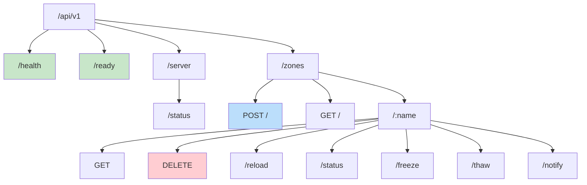

## REST Resource Model

### Resources

| Resource | HTTP Methods | Description |
|----------|--------------|-------------|
| `/health` | GET | Service health status |
| `/ready` | GET | Service readiness status |
| `/server/status` | GET | BIND9 server status |
| `/zones` | GET, POST | Zone collection |
| `/zones/{name}` | GET, DELETE | Individual zone |
| `/zones/{name}/reload` | POST | Zone reload action |
| `/zones/{name}/status` | GET | Zone status query |
| `/zones/{name}/freeze` | POST | Zone freeze action |
| `/zones/{name}/thaw` | POST | Zone thaw action |
| `/zones/{name}/notify` | POST | Zone notify action |

### HTTP Method Usage

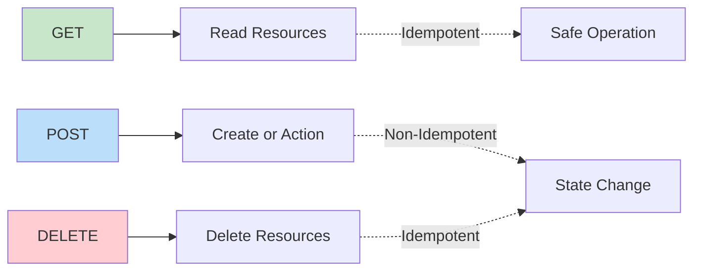

## Request/Response Format

### Standard Request

All requests follow this pattern:

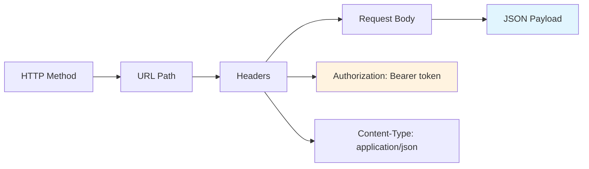

### Standard Response

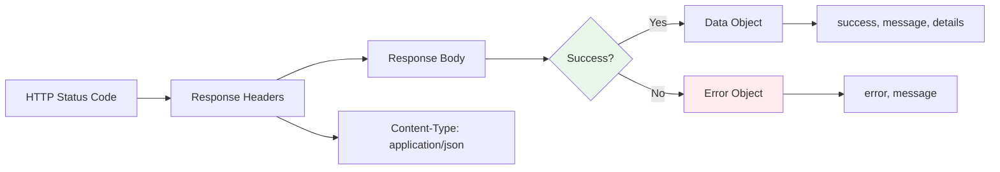

## Response Schemas

### Success Response

```json
{
  "success": true,
  "message": "Operation completed successfully",
  "details": "Additional information"
}
```

### Error Response

```json
{
  "error": "Error type",
  "message": "Human-readable error message"
}
```

## Status Code Strategy

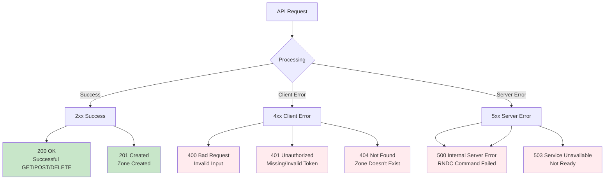

## Authentication Flow

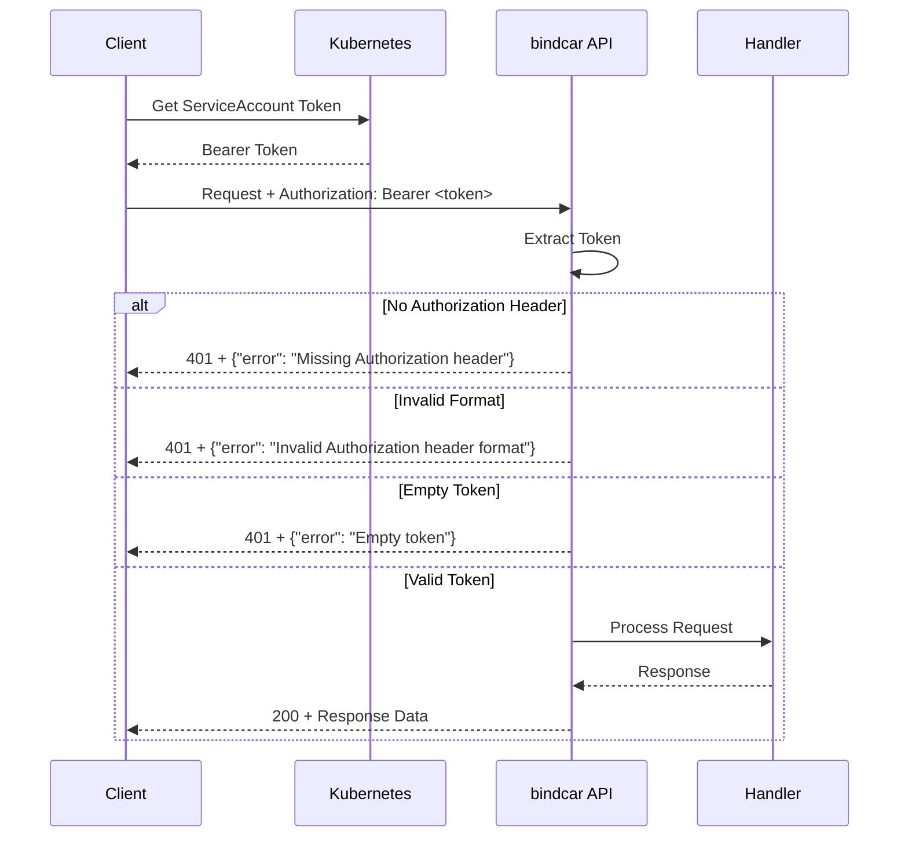

## Versioning Strategy

### URL Versioning

All endpoints include `/v1/` in the path:

```
/api/v1/zones
```

This allows for future API versions without breaking existing clients:

```
/api/v2/zones  (future)
```

### Version Migration Path

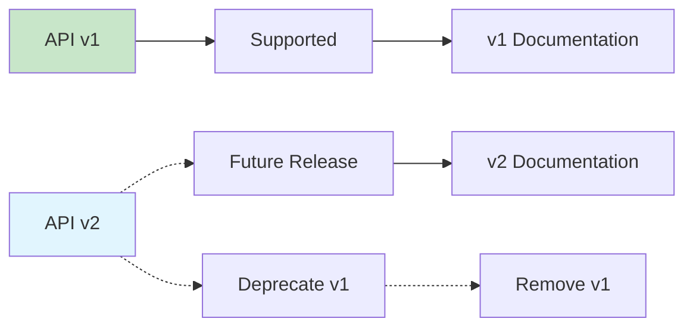

## Content Negotiation

Currently, bindcar only supports JSON:

```http
Content-Type: application/json
Accept: application/json
```

Future versions may support additional formats:

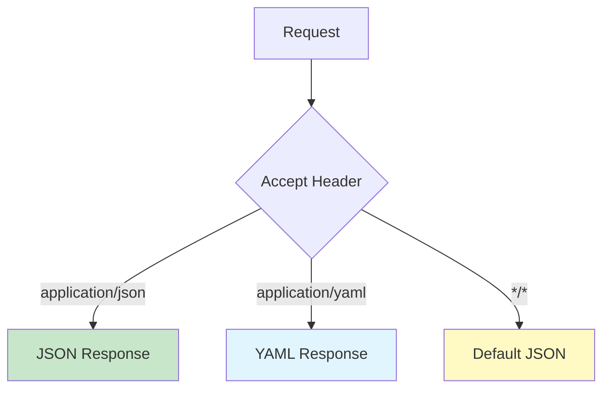

## Error Handling Philosophy

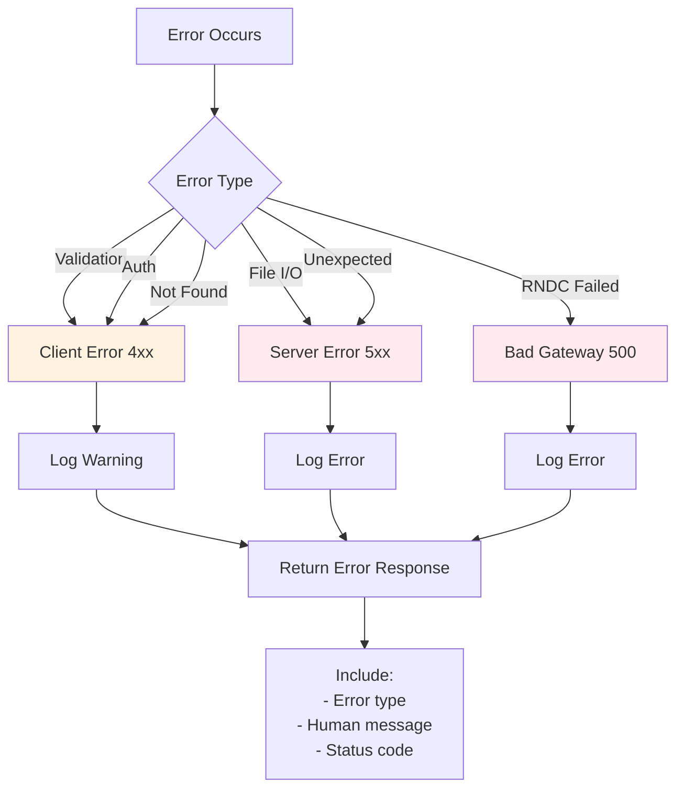

## API Evolution Guidelines

### Adding New Endpoints

✅ **Allowed** (Backward Compatible):
- Adding new endpoints
- Adding optional fields to requests
- Adding fields to responses

❌ **Not Allowed** (Breaking Changes):
- Removing endpoints
- Removing response fields
- Making optional fields required
- Changing field types

### Breaking Change Management

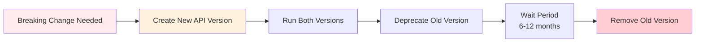

## OpenAPI / Swagger

bindcar provides interactive API documentation via Swagger UI:

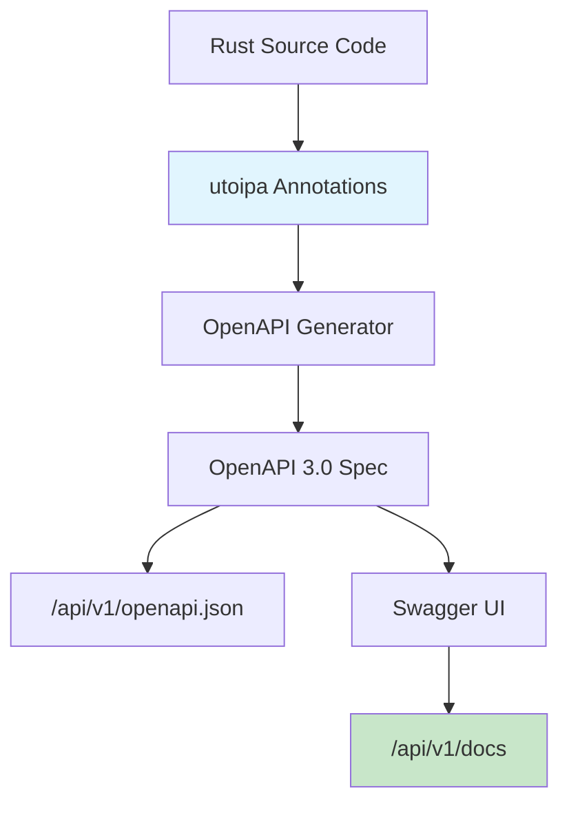

Access the interactive documentation:

```bash
# OpenAPI JSON specification
curl http://localhost:8080/api/v1/openapi.json

# Interactive Swagger UI
open http://localhost:8080/api/v1/docs
```

## Rate Limiting (Future)

While not currently implemented, future versions may include rate limiting:

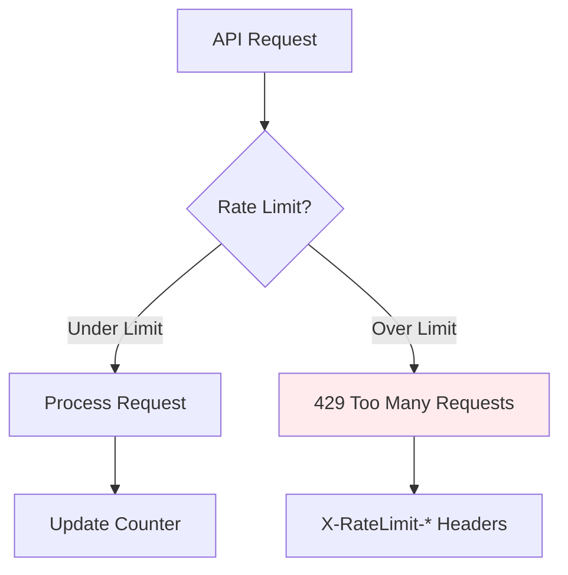
