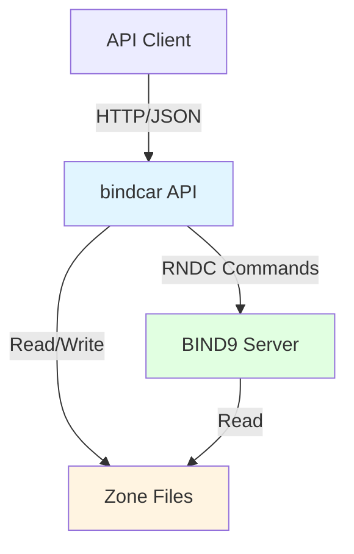
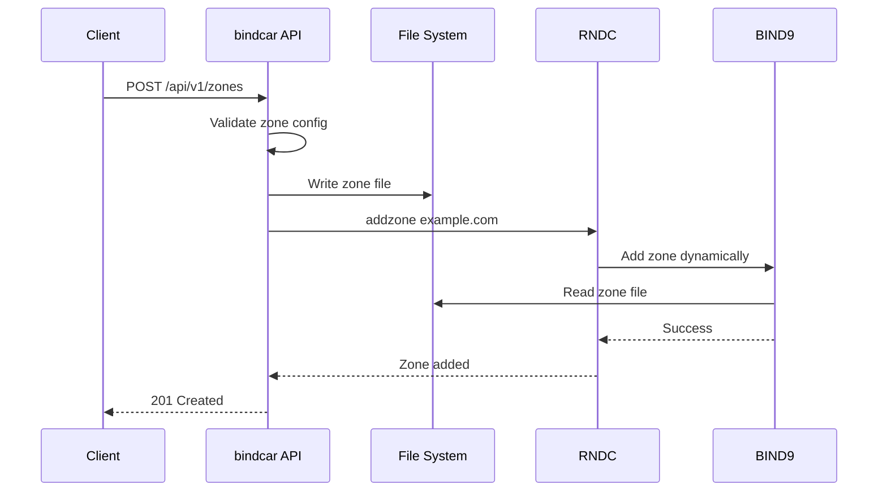
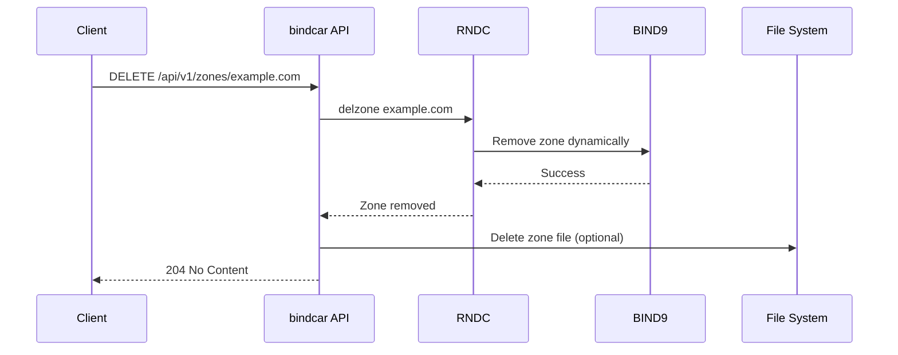

# Architecture Overview

bindcar is a lightweight HTTP REST API that provides programmatic control over BIND9 DNS zones using the RNDC (Remote Name Daemon Control) protocol.

## High-Level Architecture



## Core Components

### HTTP API Server

- **Framework**: Axum (Rust async web framework)
- **Port**: 8080 (configurable via `API_PORT`)
- **Protocol**: RESTful HTTP with JSON payloads
- **Authentication**: Bearer token or Kubernetes ServiceAccount tokens

### RNDC Integration

bindcar communicates with BIND9 via the native RNDC protocol:

- **Native Protocol**: Uses the `rndc` crate for direct RNDC protocol communication
- **Commands Used**: `addzone`, `delzone`, `reload`, `zonestatus`, `status`, `freeze`, `thaw`, `notify`
- **Authentication**: HMAC-based authentication with configurable algorithms
- **Configuration**: Supports environment variables or automatic rndc.conf parsing

### Zone File Management

- **Storage**: Zone files stored in `BIND_ZONE_DIR` (default: `/var/cache/bind`)
- **Format**: Standard BIND9 zone file format
- **Naming**: `{zone_name}.zone` (e.g., `example.com.zone`)
- **Shared Access**: Both bindcar and BIND9 must have access to the same directory

## Deployment Patterns

### Sidecar Pattern (Recommended)

In Kubernetes, bindcar runs as a sidecar container alongside BIND9:

```yaml
apiVersion: v1
kind: Pod
spec:
  containers:
  - name: bind9
    image: ubuntu/bind9:latest
    volumeMounts:
    - name: zones
      mountPath: /var/cache/bind
    - name: rndc-key
      mountPath: /etc/bind/rndc.key
      
  - name: bindcar
    image: ghcr.io/firestoned/bindcar:latest
    volumeMounts:
    - name: zones
      mountPath: /var/cache/bind
    - name: rndc-key
      mountPath: /etc/bind/rndc.key
      
  volumes:
  - name: zones
    emptyDir: {}
  - name: rndc-key
    secret:
      secretName: rndc-key
```

**Benefits**:
- Shared zone file access via volume mounts
- Shared RNDC key for authentication
- Lifecycle management handled by Kubernetes
- Easy scaling and updates

### Standalone Pattern

bindcar can also run as a standalone service connecting to remote BIND9:

```bash
docker run -d \
  -p 8080:8080 \
  -v /var/cache/bind:/var/cache/bind \
  -v /etc/bind/rndc.key:/etc/bind/rndc.key \
  ghcr.io/firestoned/bindcar:latest
```

**Use Cases**:
- Development and testing
- Simple Docker deployments
- Traditional server deployments

## Request Flow

### Zone Creation Flow



### Zone Deletion Flow



## Technology Stack

### Core Technologies

- **Language**: Rust 1.75+
- **Web Framework**: Axum (tokio-based async)
- **HTTP Client**: Tower / Hyper
- **JSON**: Serde
- **Logging**: tracing + tracing-subscriber
- **RNDC Client**: rndc crate (native protocol)

### External Dependencies

- **BIND9**: DNS server (9.16+)
- **RNDC**: BIND9 control utility

## Security Model

### Authentication

Three authentication modes supported:

1. **Basic Mode** (default): Validates token presence and format only
2. **TokenReview Mode** (feature: `k8s-token-review`): Full Kubernetes TokenReview API validation
3. **Disabled Mode**: No authentication (via `DISABLE_AUTH=true`)

**TokenReview Mode Features**:
- Validates token signatures with Kubernetes API
- Checks token expiration
- Validates token audience
- Restricts to specific namespaces (via `BIND_ALLOWED_NAMESPACES`)
- Restricts to specific ServiceAccounts (via `BIND_ALLOWED_SERVICE_ACCOUNTS`)
- Returns authenticated user information

### Authorization

**Basic Mode**:
- All API endpoints (except `/health`, `/ready`, `/metrics`) require authentication
- No fine-grained RBAC - authenticated users have full access
- Zone operations are validated before execution

**TokenReview Mode**:
- Same as Basic Mode, plus:
- Namespace-level authorization (optional)
- ServiceAccount-level authorization (optional)
- Audience-based authorization
- Defense-in-depth security model

### File System Security

- Zone directory must be writable by bindcar
- RNDC key must be readable by both bindcar and BIND9
- Container runs as non-root user (UID 101)

## Scalability Considerations

### Horizontal Scaling

- bindcar does NOT support horizontal scaling (multiple replicas)
- Only ONE bindcar instance should manage a BIND9 instance
- Use Kubernetes Deployment with `replicas: 1`

**Why?**
- Concurrent zone file writes could cause conflicts
- RNDC operations are not transactional
- Zone serial numbers could become inconsistent

### Vertical Scaling

bindcar has minimal resource requirements:

- **CPU**: 100m-500m (0.1-0.5 cores)
- **Memory**: 128Mi-256Mi
- **Network**: Minimal bandwidth

## Performance Characteristics

### Latency

Typical operation latencies:

- Health check: <5ms
- Zone creation: 50-100ms
- Zone deletion: 30-50ms
- Zone reload: 10-30ms
- Zone status: 10-20ms

Latency is primarily determined by:
1. RNDC command execution time
2. BIND9 processing time
3. File I/O speed

### Throughput

- Handles ~100-500 requests/second (single instance)
- Bottleneck is typically RNDC/BIND9, not bindcar
- Most production deployments see <10 req/s

### Resource Usage

- Idle CPU: <1%
- Idle Memory: ~10Mi
- Under load CPU: <10%
- Under load Memory: ~50Mi

## Comparison with Alternatives

### vs Manual RNDC

**bindcar Advantages**:
- RESTful API vs command-line
- JSON payloads vs text parsing
- Authentication and authorization
- Kubernetes-native (ServiceAccount auth)
- Structured logging

**Manual RNDC Advantages**:
- No additional component
- Direct control
- Simpler for one-off operations

### vs BIND9 DLZ (Dynamic Loadable Zones)

**bindcar Advantages**:
- No BIND9 recompilation required
- Works with standard BIND9 packages
- Simpler setup
- File-based zones (familiar format)

**DLZ Advantages**:
- Database-backed zones
- Higher performance for large datasets
- More flexible data sources

### vs External-DNS

**bindcar Advantages**:
- Direct zone management API
- Lower-level control
- Not tied to Kubernetes resources

**External-DNS Advantages**:
- Automatic service discovery
- Kubernetes-native (Ingress, Service resources)
- Multi-provider support (Route53, CloudDNS, etc.)

## Next Steps

- [API Design](./api-design.md) - Detailed API architecture
- [RNDC Integration](../developer-guide/rndc-integration.md) - Deep dive into RNDC
- [Deployment](../operations/deployment.md) - Deployment patterns
