# Architecture

## Overview

bindcar is designed as a sidecar container that runs alongside BIND9, providing a REST API for zone management. It acts as a bridge between Kubernetes/container orchestration and BIND9's rndc control interface.

## System Architecture

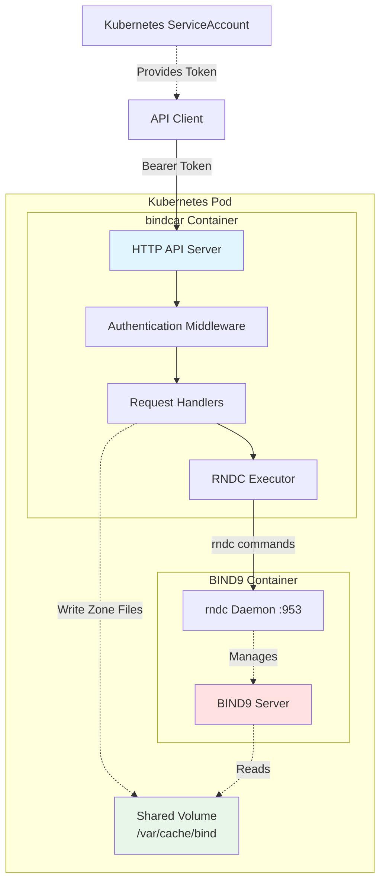

## Component Breakdown

### HTTP API Server (Axum)

- Handles incoming HTTP requests
- Provides OpenAPI/Swagger documentation
- Implements health and readiness probes
- Routes requests to appropriate handlers

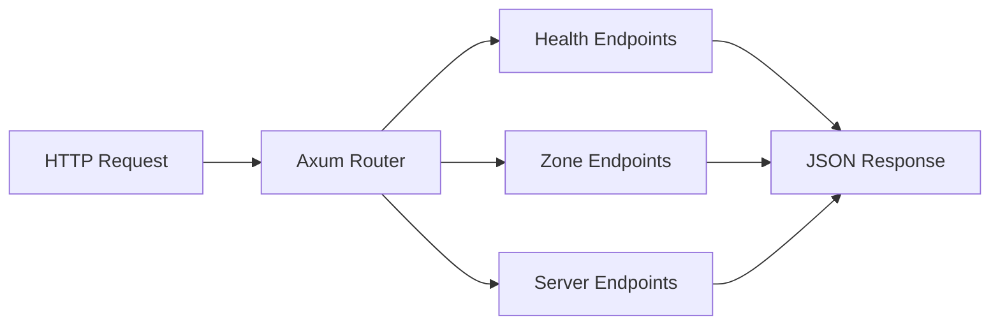

### Authentication Middleware

- Validates Bearer tokens
- Integrates with Kubernetes ServiceAccount tokens
- Protects all endpoints except health checks

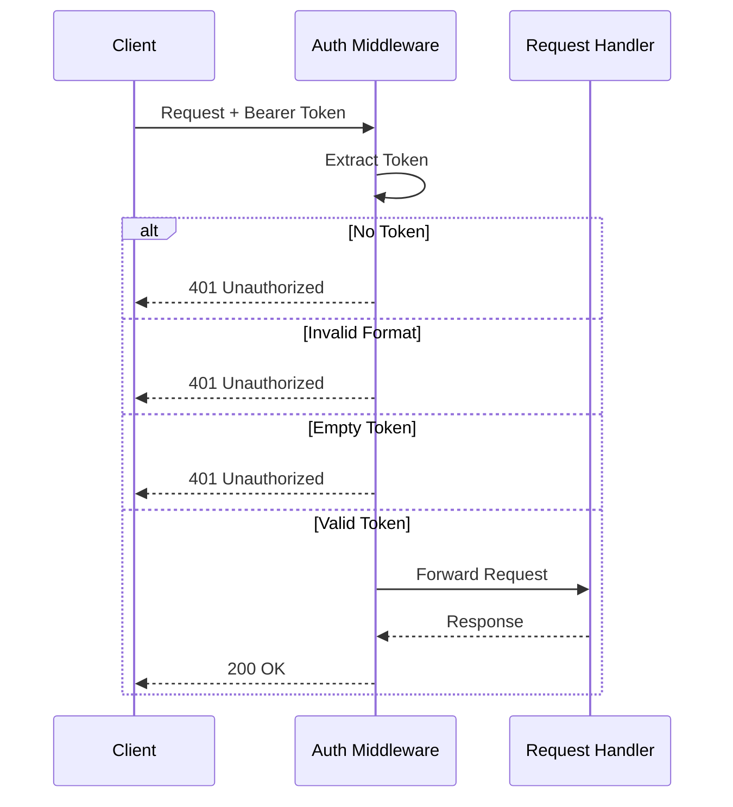

### RNDC Executor

Executes rndc commands via the system binary.

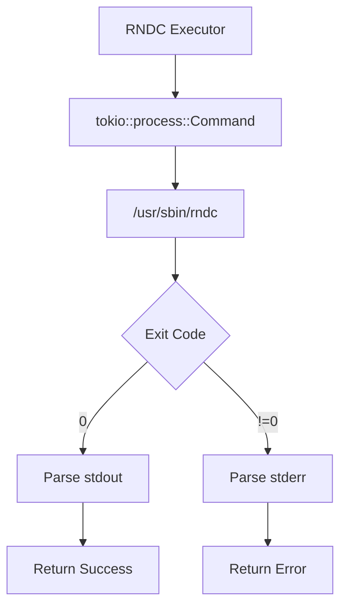

### Zone File Management

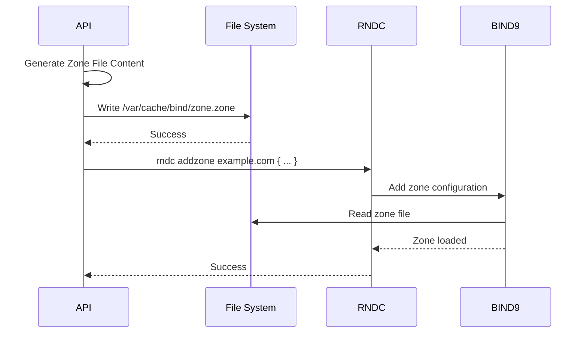

## Request Flow

### Create Zone Flow

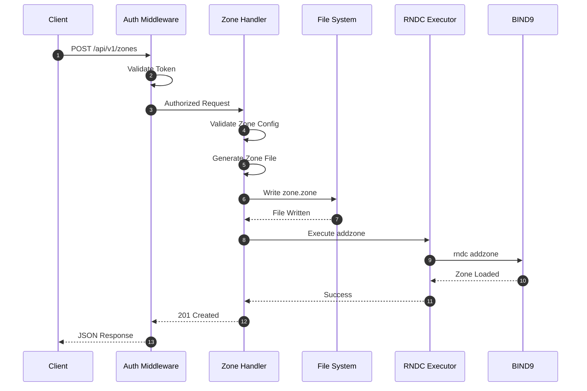

### Delete Zone Flow

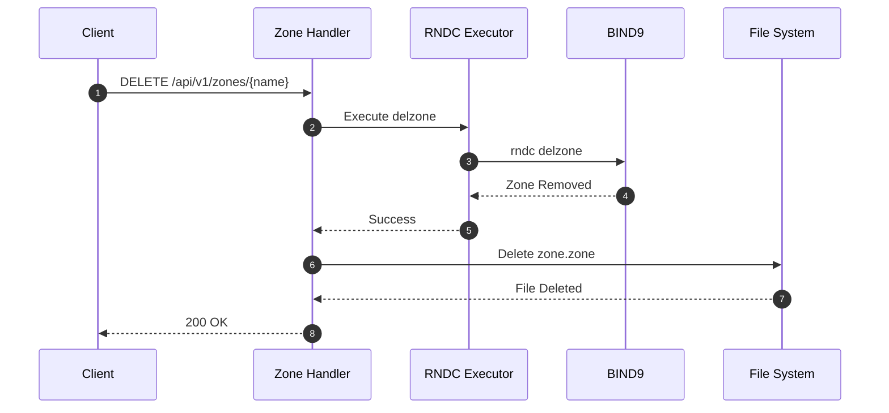

## Data Flow

### Zone Configuration to Zone File

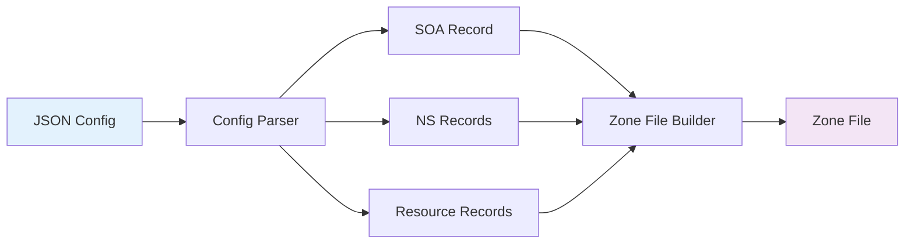

## Deployment Architecture

### Standalone Docker

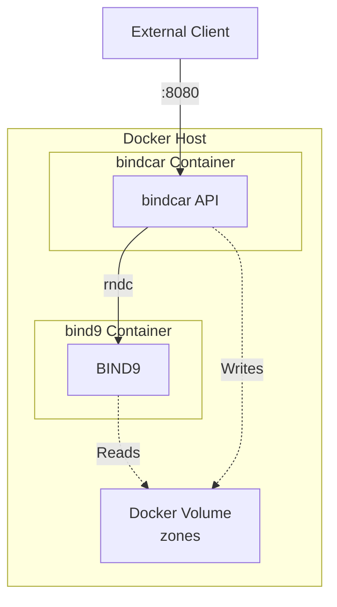

### Kubernetes Sidecar

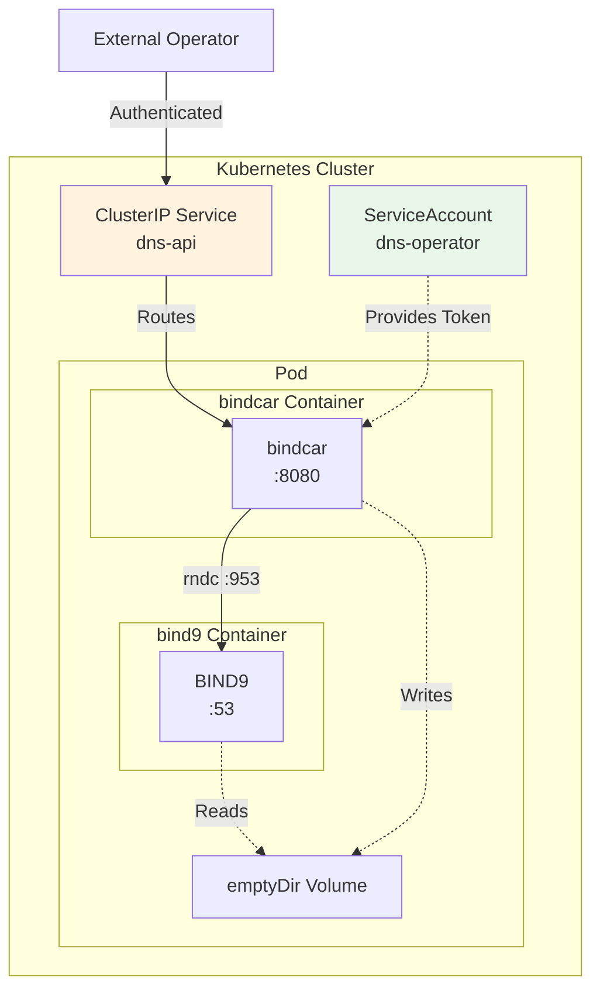

## Security Model

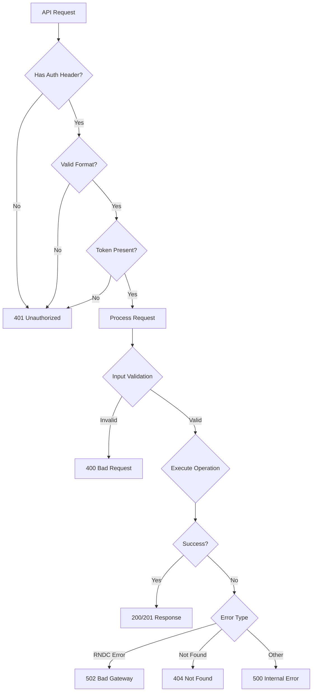

## Error Handling

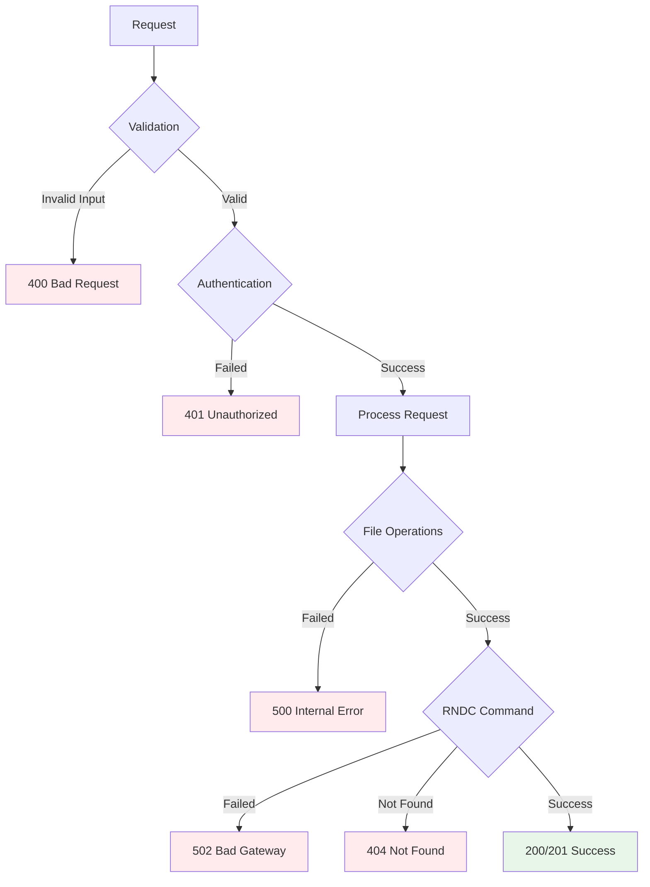

## Technology Stack

| Layer | Technology |
|-------|------------|
| HTTP Framework | Axum 0.8 |
| Async Runtime | Tokio |
| Serialization | Serde + JSON |
| Logging | Tracing + tracing-subscriber |
| API Documentation | utoipa + Swagger UI |
| RNDC Communication | System rndc binary |
| Container Runtime | Docker / containerd |
| Orchestration | Kubernetes (optional) |
