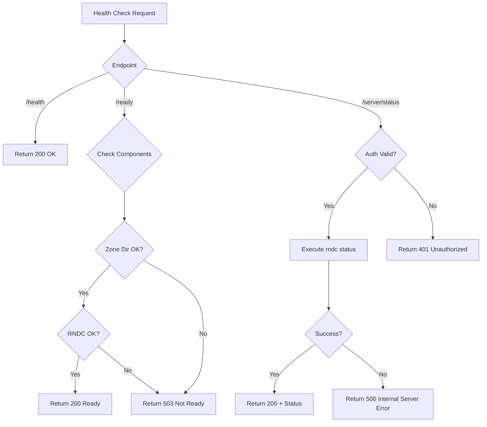

# Health & Status Endpoints

## Health Check

**GET** `/api/v1/health`

Simple health check endpoint (no authentication required).

### Request

```http
GET /api/v1/health HTTP/1.1
Host: localhost:8080
```

### Response

```json
{
  "status": "healthy"
}
```

### Status Codes

| Code | Description |
|------|-------------|
| 200  | Service is healthy |

### Example

```bash
curl http://localhost:8080/api/v1/health
```

---

## Readiness Check

**GET** `/api/v1/ready`

Comprehensive readiness check including zone directory and BIND9 connectivity (no authentication required).

### Request

```http
GET /api/v1/ready HTTP/1.1
Host: localhost:8080
```

### Response (Ready)

```json
{
  "ready": true,
  "checks": [
    "zone_dir_accessible: /var/cache/bind",
    "rndc_available: true"
  ]
}
```

### Response (Not Ready)

```json
{
  "ready": false,
  "checks": [
    "zone_dir_accessible: /var/cache/bind",
    "rndc_error: connection refused"
  ]
}
```

### Status Codes

| Code | Description |
|------|-------------|
| 200  | Service is ready |
| 503  | Service not ready |

### Example

```bash
curl http://localhost:8080/api/v1/ready
```

---

## Server Status

**GET** `/api/v1/server/status`

Retrieves BIND9 server status via rndc.

### Request

```http
GET /api/v1/server/status HTTP/1.1
Host: localhost:8080
Authorization: Bearer <token>
```

### Response

```json
{
  "status": "version: 9.18.24-1ubuntu1.1-Ubuntu\nserver is up and running"
}
```

### Status Codes

| Code | Description |
|------|-------------|
| 200  | Status retrieved successfully |
| 401  | Unauthorized |
| 500  | RNDC command failed |

### Example

```bash
curl http://localhost:8080/api/v1/server/status \
  -H "Authorization: Bearer $TOKEN"
```

---

## Health Check Flow



---

## Kubernetes Integration

### Liveness Probe

```yaml
livenessProbe:
  httpGet:
    path: /api/v1/health
    port: 8080
  initialDelaySeconds: 5
  periodSeconds: 10
```

### Readiness Probe

```yaml
readinessProbe:
  httpGet:
    path: /api/v1/ready
    port: 8080
  initialDelaySeconds: 10
  periodSeconds: 5
```
