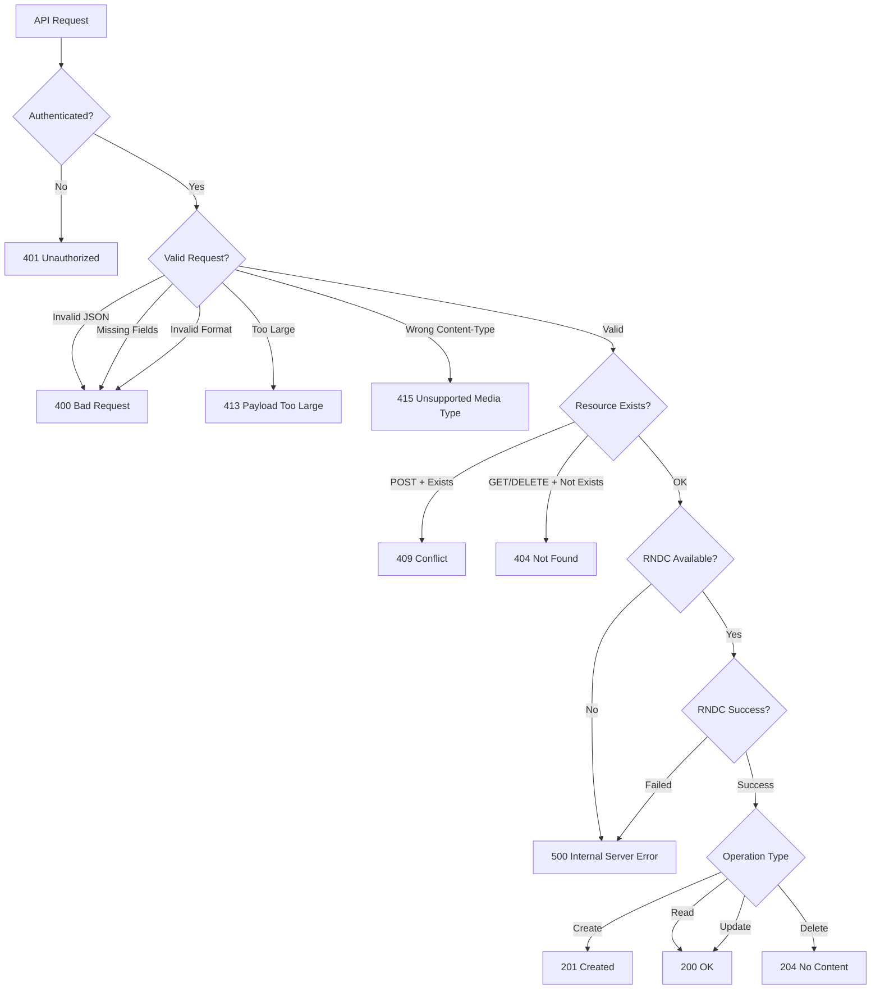

# API Status Codes

Complete HTTP status code reference for all bindcar API endpoints.

## Success Codes

### 200 OK

**When Returned**:
- GET /api/v1/zones - List zones successfully
- GET /api/v1/zones/{name} - Zone retrieved successfully
- GET /api/v1/zones/{name}/status - Zone status retrieved
- GET /api/v1/server/status - Server status retrieved
- GET /api/v1/health - Health check passed
- GET /api/v1/ready - Readiness check passed
- POST /api/v1/zones/{name}/reload - Zone reloaded successfully
- POST /api/v1/zones/{name}/freeze - Zone frozen successfully
- POST /api/v1/zones/{name}/thaw - Zone thawed successfully
- POST /api/v1/zones/{name}/notify - Notify sent successfully

**Response Body**: JSON with requested data

**Example**:
```json
{
  "zones": ["example.com", "example.org"]
}
```

### 201 Created

**When Returned**:
- POST /api/v1/zones - Zone created successfully

**Response Body**: JSON with created zone details

**Headers**:
- `Location: /api/v1/zones/{name}` - URL of created resource

**Example**:
```json
{
  "message": "Zone created successfully",
  "zone": "example.com",
  "filePath": "/var/cache/bind/example.com.zone"
}
```

### 204 No Content

**When Returned**:
- DELETE /api/v1/zones/{name} - Zone deleted successfully

**Response Body**: Empty

**Use Case**: Successful deletion with no content to return

## Client Error Codes

### 400 Bad Request

**When Returned**:
- Invalid JSON in request body
- Missing required fields
- Invalid field types
- Invalid DNS record format
- Invalid zone name format

**Response Body**: JSON error with details

**Example - Invalid JSON**:
```json
{
  "error": "Invalid JSON in request body",
  "details": "expected `,` or `}` at line 3 column 5"
}
```

**Example - Missing Field**:
```json
{
  "error": "Validation error",
  "details": "Missing required field: zoneName"
}
```

**Example - Invalid Format**:
```json
{
  "error": "Validation error",
  "details": "Invalid zone name: must contain only alphanumeric characters, hyphens, and dots"
}
```

### 401 Unauthorized

**When Returned**:
- Missing Authorization header
- Invalid Bearer token
- Expired token
- Malformed Authorization header

**Response Body**: JSON error

**Headers**:
- `WWW-Authenticate: Bearer` - Indicates Bearer token required

**Example - Missing Header**:
```json
{
  "error": "Authentication required",
  "details": "Missing Authorization header"
}
```

**Example - Invalid Token**:
```json
{
  "error": "Authentication failed",
  "details": "Invalid Bearer token"
}
```

### 404 Not Found

**When Returned**:
- GET /api/v1/zones/{name} - Zone does not exist
- DELETE /api/v1/zones/{name} - Zone does not exist
- POST /api/v1/zones/{name}/reload - Zone does not exist
- POST /api/v1/zones/{name}/freeze - Zone does not exist
- POST /api/v1/zones/{name}/thaw - Zone does not exist
- POST /api/v1/zones/{name}/notify - Zone does not exist
- Unknown API endpoint

**Response Body**: JSON error

**Example - Zone Not Found**:
```json
{
  "error": "Zone not found",
  "zone": "nonexistent.com"
}
```

**Example - Unknown Endpoint**:
```json
{
  "error": "Not found",
  "path": "/api/v1/invalid"
}
```

### 409 Conflict

**When Returned**:
- POST /api/v1/zones - Zone already exists

**Response Body**: JSON error with conflict details

**Example**:
```json
{
  "error": "Zone already exists",
  "zone": "example.com",
  "details": "rndc: 'addzone' failed: zone already exists"
}
```

### 413 Payload Too Large

**When Returned**:
- Request body exceeds maximum size limit (16 MB)

**Response Body**: JSON error

**Example**:
```json
{
  "error": "Request body too large",
  "limit": "16777216 bytes",
  "size": "17000000 bytes"
}
```

### 415 Unsupported Media Type

**When Returned**:
- Content-Type is not application/json
- Missing Content-Type header on POST/PUT requests

**Response Body**: JSON error

**Example**:
```json
{
  "error": "Unsupported media type",
  "expected": "application/json",
  "received": "text/plain"
}
```

### 422 Unprocessable Entity

**When Returned**:
- JSON is valid but data is semantically incorrect
- Invalid SOA record values
- Invalid TTL values
- Invalid DNS record combinations

**Response Body**: JSON error with validation details

**Example - Invalid SOA**:
```json
{
  "error": "Invalid zone configuration",
  "details": "SOA serial must be positive integer"
}
```

**Example - Invalid TTL**:
```json
{
  "error": "Invalid zone configuration",
  "details": "TTL must be between 0 and 2147483647"
}
```

### 429 Too Many Requests

**When Returned**:
- Client IP address has exceeded the configured rate limit
- Default: 100 requests per 60 seconds with burst of 10

**Response Body**: Plain text message

**Example**:
```
Rate limit exceeded. Please try again later.
```

**Configuration**:
Rate limiting can be configured via environment variables:
- `RATE_LIMIT_ENABLED` - Enable/disable (default: `true`)
- `RATE_LIMIT_REQUESTS` - Max requests per period (default: `100`)
- `RATE_LIMIT_PERIOD_SECS` - Period in seconds (default: `60`)
- `RATE_LIMIT_BURST` - Burst size (default: `10`)

**Client Detection**:
Client IP is extracted from (in order):
1. `X-Forwarded-For` header (first IP)
2. `X-Real-IP` header
3. Peer socket address

**Note**: Rate limiting uses the GCRA (Generic Cell Rate Algorithm) for sophisticated, per-IP address rate limiting.

## Server Error Codes

### 500 Internal Server Error

**When Returned**:
- Unexpected internal error
- Panic or unhandled exception
- File I/O error (non-RNDC related)

**Response Body**: JSON error

**Example**:
```json
{
  "error": "Internal server error",
  "details": "An unexpected error occurred"
}
```

**Note**: Details may be limited to avoid exposing internal implementation

### 500 Internal Server Error

**When Returned**:
- RNDC command execution failed
- BIND9 not responding
- RNDC connection refused
- RNDC authentication failure
- Zone file write error
- Zone file syntax error detected by BIND9

**Response Body**: JSON error with RNDC error details

**Example - BIND9 Not Running**:
```json
{
  "error": "RNDC command failed",
  "command": "addzone",
  "details": "rndc: connect failed: connection refused"
}
```

**Example - Permission Error**:
```json
{
  "error": "RNDC command failed",
  "command": "reload",
  "details": "rndc: 'reload' failed: permission denied"
}
```

**Example - Zone File Error**:
```json
{
  "error": "Failed to write zone file",
  "zone": "example.com",
  "details": "Permission denied: /var/cache/bind/example.com.zone"
}
```

### 503 Service Unavailable

**When Returned**:
- GET /api/v1/health - Service is unhealthy
- GET /api/v1/ready - Service is not ready
- Server is shutting down
- Zone directory not accessible

**Response Body**: JSON error with health status

**Example - Not Ready**:
```json
{
  "ready": false,
  "checks": {
    "zone_directory": "failed",
    "rndc_binary": "ok"
  },
  "error": "Zone directory not writable"
}
```

**Example - Shutting Down**:
```json
{
  "error": "Service unavailable",
  "details": "Server is shutting down"
}
```

## Status Code Decision Tree



## HTTP Methods and Status Codes

### POST Endpoints

| Endpoint | Success | Error Codes |
|----------|---------|-------------|
| /api/v1/zones | 201 Created | 400, 401, 409, 413, 415, 422, 429, 500, 503 |
| /api/v1/zones/{name}/reload | 200 OK | 401, 404, 429, 500, 503 |
| /api/v1/zones/{name}/freeze | 200 OK | 401, 404, 429, 500, 503 |
| /api/v1/zones/{name}/thaw | 200 OK | 401, 404, 429, 500, 503 |
| /api/v1/zones/{name}/notify | 200 OK | 401, 404, 429, 500, 503 |

### GET Endpoints

| Endpoint | Success | Error Codes |
|----------|---------|-------------|
| /api/v1/health | 200 OK | 503 Service Unavailable |
| /api/v1/ready | 200 OK | 503 Service Unavailable |
| /api/v1/zones | 200 OK | 401, 429, 500, 503 |
| /api/v1/zones/{name} | 200 OK | 401, 404, 429, 500, 503 |
| /api/v1/zones/{name}/status | 200 OK | 401, 404, 429, 500, 503 |
| /api/v1/server/status | 200 OK | 401, 429, 500, 503 |

### DELETE Endpoints

| Endpoint | Success | Error Codes |
|----------|---------|-------------|
| /api/v1/zones/{name} | 204 No Content | 401, 404, 429, 500, 503 |

## Best Practices

### Client Error Handling

Always check status codes and handle errors appropriately:

```bash
# Check for success
response=$(curl -s -w "\n%{http_code}" \
  -X POST http://localhost:8080/api/v1/zones \
  -H "Authorization: Bearer $TOKEN" \
  -H "Content-Type: application/json" \
  -d @zone.json)

body=$(echo "$response" | head -n -1)
status=$(echo "$response" | tail -n 1)

case $status in
  201)
    echo "Zone created successfully"
    ;;
  400)
    echo "Invalid request: $body"
    exit 1
    ;;
  401)
    echo "Authentication failed"
    exit 1
    ;;
  409)
    echo "Zone already exists"
    exit 1
    ;;
  429)
    echo "Rate limit exceeded - backing off"
    sleep 60
    exit 1
    ;;
  500)
    echo "RNDC error: $body"
    exit 1
    ;;
  *)
    echo "Unexpected error: $status - $body"
    exit 1
    ;;
esac
```

### Retry Logic

Implement retry logic for transient errors:

```python
import requests
import time

def create_zone(zone_data, max_retries=3):
    url = "http://localhost:8080/api/v1/zones"
    headers = {
        "Authorization": f"Bearer {token}",
        "Content-Type": "application/json"
    }
    
    for attempt in range(max_retries):
        response = requests.post(url, json=zone_data, headers=headers)
        
        if response.status_code == 201:
            return response.json()
        elif response.status_code == 429:
            # Rate limited - back off exponentially
            time.sleep(60 * (2 ** attempt))
            continue
        elif response.status_code in [500, 503]:
            # Retry on server errors
            time.sleep(2 ** attempt)
            continue
        else:
            # Don't retry on client errors
            response.raise_for_status()
    
    raise Exception(f"Failed after {max_retries} retries")
```

### Logging Status Codes

Monitor status code distribution for anomalies:

```bash
# Count status codes in logs
kubectl logs -l app=dns -c bindcar | \
  jq -r '.status' | \
  sort | uniq -c | sort -rn

# Alert on high error rate
ERROR_RATE=$(kubectl logs -l app=dns -c bindcar --since=5m | \
  jq -r 'select(.status >= 500) | .status' | wc -l)

if [ $ERROR_RATE -gt 10 ]; then
  echo "High error rate detected: $ERROR_RATE errors in last 5 minutes"
fi
```

## Next Steps

- [API Overview](../user-guide/api-overview.md) - API design and endpoints
- [Troubleshooting](../operations/troubleshooting.md) - Debugging API errors
- [Examples](./examples.md) - Complete API usage examples
