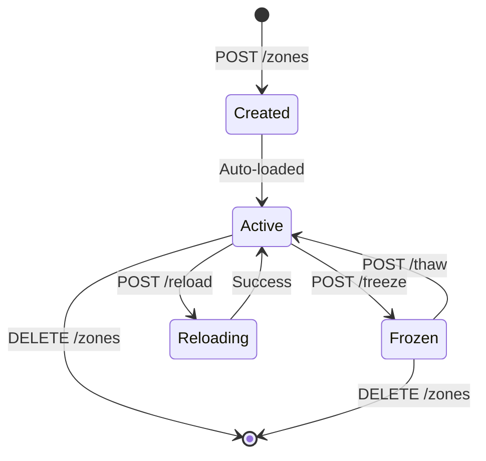

# Zone Endpoints

## Create Zone

**POST** `/api/v1/zones`

Creates a new DNS zone with the specified configuration.

### Request

```http
POST /api/v1/zones HTTP/1.1
Host: localhost:8080
Authorization: Bearer <token>
Content-Type: application/json

{
  "zoneName": "example.com",
  "zoneType": "primary",
  "zoneConfig": {
    "ttl": 3600,
    "soa": {
      "primaryNs": "ns1.example.com.",
      "adminEmail": "admin.example.com.",
      "serial": 2025010101,
      "refresh": 3600,
      "retry": 600,
      "expire": 604800,
      "negativeTtl": 86400
    },
    "nameServers": [
      "ns1.example.com.",
      "ns2.example.com."
    ],
    "records": [
      {
        "name": "www",
        "type": "A",
        "value": "192.0.2.1",
        "ttl": 300
      }
    ]
  }
}
```

### Response

```json
{
  "success": true,
  "message": "Zone example.com created successfully",
  "details": "zone example.com/IN: loaded serial 2025010101"
}
```

### Errors

| Code | Description |
|------|-------------|
| 400  | Invalid zone name or configuration |
| 502  | RNDC command failed |

### Example - Primary Zone

```bash
curl -X POST http://localhost:8080/api/v1/zones \
  -H "Authorization: Bearer $TOKEN" \
  -H "Content-Type: application/json" \
  -d '{
    "zoneName": "example.com",
    "zoneType": "primary",
    "zoneConfig": {
      "ttl": 3600,
      "soa": {
        "primaryNs": "ns1.example.com.",
        "adminEmail": "admin.example.com.",
        "serial": 2025010101
      },
      "nameServers": ["ns1.example.com."],
      "nameServerIps": {}
    }
  }'
```

### Example - Secondary Zone

```bash
curl -X POST http://localhost:8080/api/v1/zones \
  -H "Authorization: Bearer $TOKEN" \
  -H "Content-Type: application/json" \
  -d '{
    "zoneName": "example.com",
    "zoneType": "secondary",
    "zoneConfig": {
      "ttl": 3600,
      "soa": {
        "primaryNs": "ns1.example.com.",
        "adminEmail": "admin.example.com.",
        "serial": 2025010101
      },
      "nameServers": ["ns1.example.com."],
      "nameServerIps": {},
      "primaries": ["192.0.2.1", "192.0.2.2"]
    }
  }'
```

**Note**: Secondary zones require the `primaries` field with at least one IP address of the primary server(s).

---

## List Zones

**GET** `/api/v1/zones`

Returns a list of all zones.

### Request

```http
GET /api/v1/zones HTTP/1.1
Host: localhost:8080
Authorization: Bearer <token>
```

### Response

```json
{
  "zones": [
    "example.com",
    "test.com"
  ],
  "count": 2
}
```

### Example

```bash
curl http://localhost:8080/api/v1/zones \
  -H "Authorization: Bearer $TOKEN"
```

---

## Get Zone

**GET** `/api/v1/zones/{name}`

Retrieves information about a specific zone.

### Request

```http
GET /api/v1/zones/example.com HTTP/1.1
Host: localhost:8080
Authorization: Bearer <token>
```

### Response

```json
{
  "name": "example.com",
  "zoneType": "primary",
  "serial": 2025010101,
  "filePath": "/var/cache/bind/example.com.zone"
}
```

### Errors

| Code | Description |
|------|-------------|
| 404  | Zone not found |
| 502  | RNDC command failed |

### Example

```bash
curl http://localhost:8080/api/v1/zones/example.com \
  -H "Authorization: Bearer $TOKEN"
```

---

## Delete Zone

**DELETE** `/api/v1/zones/{name}`

Deletes a zone and its zone file.

### Request

```http
DELETE /api/v1/zones/example.com HTTP/1.1
Host: localhost:8080
Authorization: Bearer <token>
```

### Response

```json
{
  "success": true,
  "message": "Zone example.com deleted successfully"
}
```

### Errors

| Code | Description |
|------|-------------|
| 404  | Zone not found |
| 502  | RNDC command failed |

### Example

```bash
curl -X DELETE http://localhost:8080/api/v1/zones/example.com \
  -H "Authorization: Bearer $TOKEN"
```

---

## Modify Zone

**PATCH** `/api/v1/zones/{name}`

Modifies zone configuration parameters such as `also-notify` and `allow-transfer` IP addresses without recreating the zone. This endpoint uses the `rndc modzone` command to dynamically update the zone configuration in BIND9.

### Request

```http
PATCH /api/v1/zones/example.com HTTP/1.1
Host: localhost:8080
Authorization: Bearer <token>
Content-Type: application/json

{
  "alsoNotify": ["10.244.2.101", "10.244.2.102"],
  "allowTransfer": ["10.244.2.101", "10.244.2.102"]
}
```

### Request Body

| Field | Type | Required | Description |
|-------|------|----------|-------------|
| `alsoNotify` | array[string] | No | IP addresses of secondary servers to notify when zone changes |
| `allowTransfer` | array[string] | No | IP addresses allowed to transfer the zone |

**Note**: At least one field must be provided. Both fields are optional, but the request cannot be empty.

### Response

```json
{
  "success": true,
  "message": "Zone example.com modified successfully",
  "details": "zone example.com/IN: reconfigured"
}
```

### Errors

| Code | Description |
|------|-------------|
| 400  | Invalid request (empty request or invalid IP addresses) |
| 404  | Zone not found |
| 502  | RNDC command failed |

### Examples

#### Update both also-notify and allow-transfer

```bash
curl -X PATCH http://localhost:8080/api/v1/zones/example.com \
  -H "Authorization: Bearer $TOKEN" \
  -H "Content-Type: application/json" \
  -d '{
    "alsoNotify": ["10.244.2.101", "10.244.2.102"],
    "allowTransfer": ["10.244.2.101", "10.244.2.102"]
  }'
```

#### Update only also-notify

```bash
curl -X PATCH http://localhost:8080/api/v1/zones/example.com \
  -H "Authorization: Bearer $TOKEN" \
  -H "Content-Type: application/json" \
  -d '{
    "alsoNotify": ["10.244.2.101"]
  }'
```

#### Update only allow-transfer

```bash
curl -X PATCH http://localhost:8080/api/v1/zones/example.com \
  -H "Authorization: Bearer $TOKEN" \
  -H "Content-Type: application/json" \
  -d '{
    "allowTransfer": ["10.244.2.103", "10.244.2.104"]
  }'
```

#### Clear also-notify (set to empty)

```bash
curl -X PATCH http://localhost:8080/api/v1/zones/example.com \
  -H "Authorization: Bearer $TOKEN" \
  -H "Content-Type: application/json" \
  -d '{
    "alsoNotify": []
  }'
```

#### Using IPv6 addresses

```bash
curl -X PATCH http://localhost:8080/api/v1/zones/example.com \
  -H "Authorization: Bearer $TOKEN" \
  -H "Content-Type: application/json" \
  -d '{
    "alsoNotify": ["2001:db8::1", "2001:db8::2"],
    "allowTransfer": ["2001:db8::3"]
  }'
```

### Use Cases

- **Zone Replication**: Add or update secondary DNS servers that should receive zone transfer notifications
- **Access Control**: Control which servers are allowed to perform zone transfers
- **Dynamic Updates**: Modify zone transfer settings without deleting and recreating the zone
- **High Availability**: Update secondary server lists as your infrastructure changes

### Notes

- This operation works with both primary and secondary zones
- Changes take effect immediately without requiring a zone reload
- For secondary zones, the zone file may not exist; the endpoint checks zone status to verify existence
- Empty arrays can be used to clear/remove existing settings
- Both IPv4 and IPv6 addresses are supported

---

## Reload Zone

**POST** `/api/v1/zones/{name}/reload`

Reloads a zone from its zone file.

### Request

```http
POST /api/v1/zones/example.com/reload HTTP/1.1
Host: localhost:8080
Authorization: Bearer <token>
```

### Response

```json
{
  "success": true,
  "message": "Zone example.com reloaded successfully",
  "details": "zone example.com/IN: loaded serial 2025010102"
}
```

### Example

```bash
curl -X POST http://localhost:8080/api/v1/zones/example.com/reload \
  -H "Authorization: Bearer $TOKEN"
```

---

## Zone Status

**GET** `/api/v1/zones/{name}/status`

Gets the current status of a zone.

### Request

```http
GET /api/v1/zones/example.com/status HTTP/1.1
Host: localhost:8080
Authorization: Bearer <token>
```

### Response

```json
{
  "success": true,
  "message": "Zone example.com status retrieved",
  "details": "name: example.com\ntype: master\nserial: 2025010101"
}
```

### Example

```bash
curl http://localhost:8080/api/v1/zones/example.com/status \
  -H "Authorization: Bearer $TOKEN"
```

---

## Freeze Zone

**POST** `/api/v1/zones/{name}/freeze`

Freezes dynamic updates for a zone.

### Request

```http
POST /api/v1/zones/example.com/freeze HTTP/1.1
Host: localhost:8080
Authorization: Bearer <token>
```

### Response

```json
{
  "success": true,
  "message": "Zone example.com frozen successfully"
}
```

### Example

```bash
curl -X POST http://localhost:8080/api/v1/zones/example.com/freeze \
  -H "Authorization: Bearer $TOKEN"
```

---

## Thaw Zone

**POST** `/api/v1/zones/{name}/thaw`

Re-enables dynamic updates for a zone.

### Request

```http
POST /api/v1/zones/example.com/thaw HTTP/1.1
Host: localhost:8080
Authorization: Bearer <token>
```

### Response

```json
{
  "success": true,
  "message": "Zone example.com thawed successfully"
}
```

### Example

```bash
curl -X POST http://localhost:8080/api/v1/zones/example.com/thaw \
  -H "Authorization: Bearer $TOKEN"
```

---

## Notify Secondaries

**POST** `/api/v1/zones/{name}/notify`

Sends a NOTIFY message to secondary servers.

### Request

```http
POST /api/v1/zones/example.com/notify HTTP/1.1
Host: localhost:8080
Authorization: Bearer <token>
```

### Response

```json
{
  "success": true,
  "message": "Notify sent for zone example.com"
}
```

### Example

```bash
curl -X POST http://localhost:8080/api/v1/zones/example.com/notify \
  -H "Authorization: Bearer $TOKEN"
```

---

## Zone Lifecycle


