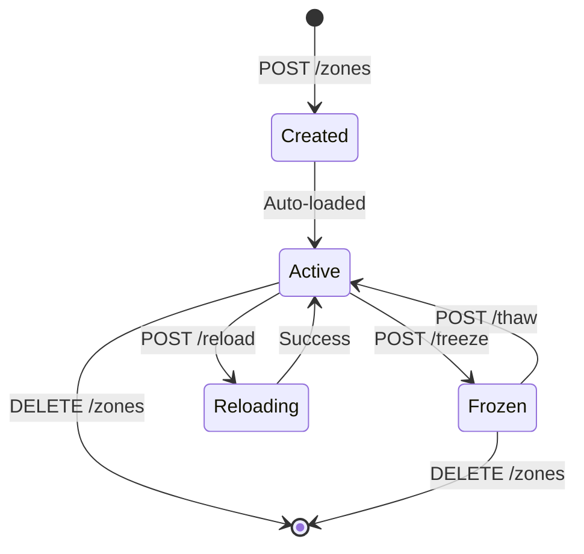

# Zone Endpoints

## Create Zone

**POST** `/api/v1/zones`

Creates a new DNS zone with the specified configuration.

### Request

```http
POST /api/v1/zones HTTP/1.1
Host: localhost:8080
Authorization: Bearer <token>
Content-Type: application/json

{
  "zoneName": "example.com",
  "zoneType": "primary",
  "zoneConfig": {
    "ttl": 3600,
    "soa": {
      "primaryNs": "ns1.example.com.",
      "adminEmail": "admin.example.com.",
      "serial": 2025010101,
      "refresh": 3600,
      "retry": 600,
      "expire": 604800,
      "negativeTtl": 86400
    },
    "nameServers": [
      "ns1.example.com.",
      "ns2.example.com."
    ],
    "records": [
      {
        "name": "www",
        "type": "A",
        "value": "192.0.2.1",
        "ttl": 300
      }
    ]
  }
}
```

### Response

```json
{
  "success": true,
  "message": "Zone example.com created successfully",
  "details": "zone example.com/IN: loaded serial 2025010101"
}
```

### Errors

| Code | Description |
|------|-------------|
| 400  | Invalid zone name or configuration |
| 502  | RNDC command failed |

### Example

```bash
curl -X POST http://localhost:8080/api/v1/zones \
  -H "Authorization: Bearer $TOKEN" \
  -H "Content-Type: application/json" \
  -d '{
    "zoneName": "example.com",
    "zoneType": "primary",
    "zoneConfig": {
      "ttl": 3600,
      "soa": {
        "primaryNs": "ns1.example.com.",
        "adminEmail": "admin.example.com.",
        "serial": 2025010101
      },
      "nameServers": ["ns1.example.com."]
    }
  }'
```

---

## List Zones

**GET** `/api/v1/zones`

Returns a list of all zones.

### Request

```http
GET /api/v1/zones HTTP/1.1
Host: localhost:8080
Authorization: Bearer <token>
```

### Response

```json
{
  "zones": [
    "example.com",
    "test.com"
  ],
  "count": 2
}
```

### Example

```bash
curl http://localhost:8080/api/v1/zones \
  -H "Authorization: Bearer $TOKEN"
```

---

## Get Zone

**GET** `/api/v1/zones/{name}`

Retrieves information about a specific zone.

### Request

```http
GET /api/v1/zones/example.com HTTP/1.1
Host: localhost:8080
Authorization: Bearer <token>
```

### Response

```json
{
  "name": "example.com",
  "zoneType": "primary",
  "serial": 2025010101,
  "filePath": "/var/cache/bind/example.com.zone"
}
```

### Errors

| Code | Description |
|------|-------------|
| 404  | Zone not found |
| 502  | RNDC command failed |

### Example

```bash
curl http://localhost:8080/api/v1/zones/example.com \
  -H "Authorization: Bearer $TOKEN"
```

---

## Delete Zone

**DELETE** `/api/v1/zones/{name}`

Deletes a zone and its zone file.

### Request

```http
DELETE /api/v1/zones/example.com HTTP/1.1
Host: localhost:8080
Authorization: Bearer <token>
```

### Response

```json
{
  "success": true,
  "message": "Zone example.com deleted successfully"
}
```

### Errors

| Code | Description |
|------|-------------|
| 404  | Zone not found |
| 502  | RNDC command failed |

### Example

```bash
curl -X DELETE http://localhost:8080/api/v1/zones/example.com \
  -H "Authorization: Bearer $TOKEN"
```

---

## Reload Zone

**POST** `/api/v1/zones/{name}/reload`

Reloads a zone from its zone file.

### Request

```http
POST /api/v1/zones/example.com/reload HTTP/1.1
Host: localhost:8080
Authorization: Bearer <token>
```

### Response

```json
{
  "success": true,
  "message": "Zone example.com reloaded successfully",
  "details": "zone example.com/IN: loaded serial 2025010102"
}
```

### Example

```bash
curl -X POST http://localhost:8080/api/v1/zones/example.com/reload \
  -H "Authorization: Bearer $TOKEN"
```

---

## Zone Status

**GET** `/api/v1/zones/{name}/status`

Gets the current status of a zone.

### Request

```http
GET /api/v1/zones/example.com/status HTTP/1.1
Host: localhost:8080
Authorization: Bearer <token>
```

### Response

```json
{
  "success": true,
  "message": "Zone example.com status retrieved",
  "details": "name: example.com\ntype: master\nserial: 2025010101"
}
```

### Example

```bash
curl http://localhost:8080/api/v1/zones/example.com/status \
  -H "Authorization: Bearer $TOKEN"
```

---

## Freeze Zone

**POST** `/api/v1/zones/{name}/freeze`

Freezes dynamic updates for a zone.

### Request

```http
POST /api/v1/zones/example.com/freeze HTTP/1.1
Host: localhost:8080
Authorization: Bearer <token>
```

### Response

```json
{
  "success": true,
  "message": "Zone example.com frozen successfully"
}
```

### Example

```bash
curl -X POST http://localhost:8080/api/v1/zones/example.com/freeze \
  -H "Authorization: Bearer $TOKEN"
```

---

## Thaw Zone

**POST** `/api/v1/zones/{name}/thaw`

Re-enables dynamic updates for a zone.

### Request

```http
POST /api/v1/zones/example.com/thaw HTTP/1.1
Host: localhost:8080
Authorization: Bearer <token>
```

### Response

```json
{
  "success": true,
  "message": "Zone example.com thawed successfully"
}
```

### Example

```bash
curl -X POST http://localhost:8080/api/v1/zones/example.com/thaw \
  -H "Authorization: Bearer $TOKEN"
```

---

## Notify Secondaries

**POST** `/api/v1/zones/{name}/notify`

Sends a NOTIFY message to secondary servers.

### Request

```http
POST /api/v1/zones/example.com/notify HTTP/1.1
Host: localhost:8080
Authorization: Bearer <token>
```

### Response

```json
{
  "success": true,
  "message": "Notify sent for zone example.com"
}
```

### Example

```bash
curl -X POST http://localhost:8080/api/v1/zones/example.com/notify \
  -H "Authorization: Bearer $TOKEN"
```

---

## Zone Lifecycle


