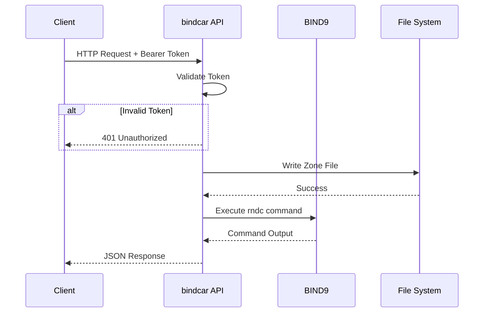

# API Reference

bindcar provides a REST API for managing BIND9 zones. All endpoints return JSON responses and require authentication (except health checks).

## Base URL

```
http://localhost:8080/api/v1
```

## Authentication

All API endpoints (except `/health` and `/ready`) require Bearer token authentication:

```bash
curl -H "Authorization: Bearer <token>" http://localhost:8080/api/v1/zones
```

In Kubernetes, use the ServiceAccount token:

```bash
TOKEN=$(cat /var/run/secrets/kubernetes.io/serviceaccount/token)
curl -H "Authorization: Bearer $TOKEN" http://bindcar:8080/api/v1/zones
```

## Request/Response Flow



## Common Response Codes

| Code | Description |
|------|-------------|
| 200  | Success |
| 201  | Created |
| 400  | Bad Request - Invalid input |
| 401  | Unauthorized - Missing or invalid token |
| 404  | Not Found - Zone doesn't exist |
| 500  | Internal Server Error |
| 502  | Bad Gateway - RNDC command failed |

## Endpoints Overview

### Health & Monitoring

- [GET /api/v1/health](./api-health.md#health-check) - Service health
- [GET /api/v1/ready](./api-health.md#readiness-check) - Service readiness
- [GET /api/v1/server/status](./api-health.md#server-status) - BIND9 status

### Zone Management

- [POST /api/v1/zones](./api-zones.md#create-zone) - Create new zone
- [GET /api/v1/zones](./api-zones.md#list-zones) - List all zones
- [GET /api/v1/zones/{name}](./api-zones.md#get-zone) - Get zone information
- [DELETE /api/v1/zones/{name}](./api-zones.md#delete-zone) - Delete zone
- [POST /api/v1/zones/{name}/reload](./api-zones.md#reload-zone) - Reload zone
- [GET /api/v1/zones/{name}/status](./api-zones.md#zone-status) - Get zone status
- [POST /api/v1/zones/{name}/freeze](./api-zones.md#freeze-zone) - Freeze zone (disable updates)
- [POST /api/v1/zones/{name}/thaw](./api-zones.md#thaw-zone) - Thaw zone (enable updates)
- [POST /api/v1/zones/{name}/notify](./api-zones.md#notify-secondaries) - Notify secondary servers

## Interactive API Documentation

bindcar includes a Swagger UI for interactive API exploration:

```
http://localhost:8080/api/v1/docs
```

The OpenAPI specification is available at:

```
http://localhost:8080/api/v1/openapi.json
```
