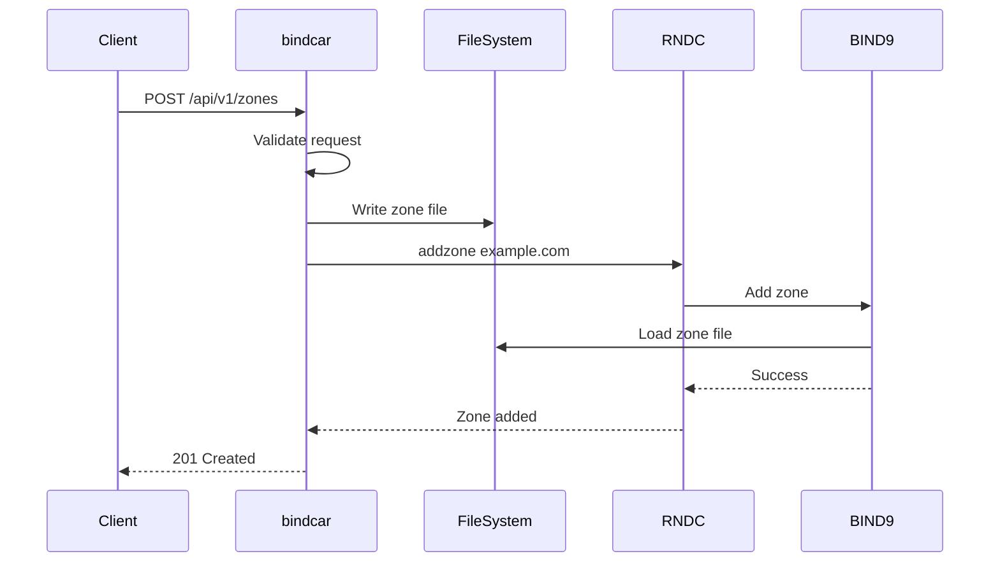

# Creating Zones

Create new DNS zones using the bindcar API.

## Quick Start

### Basic Zone Creation

```bash
curl -X POST http://localhost:8080/api/v1/zones \
  -H "Authorization: Bearer $TOKEN" \
  -H "Content-Type: application/json" \
  -d '{
    "zoneName": "example.com",
    "zoneType": "primary",
    "zoneConfig": {
      "ttl": 3600,
      "soa": {
        "primaryNs": "ns1.example.com.",
        "adminEmail": "admin.example.com.",
        "serial": 1,
        "refresh": 3600,
        "retry": 1800,
        "expire": 604800,
        "negativeTtl": 86400
      }
    }
  }'
```

### Response

```json
{
  "success": true,
  "message": "Zone example.com created successfully",
  "details": "zone example.com/IN: loaded serial 2025010101"
}
```

## Zone Creation Process

When you create a zone, bindcar performs these steps:

1. **Validate Request** - Check zone name format and required fields
2. **Generate Zone File** - Create BIND9-format zone file with SOA record
3. **Clean Journal Files** - Remove any existing `.zone.jnl` files to prevent "journal out of sync" errors
4. **Write to Disk** - Save zone file to `BIND_ZONE_DIR`
5. **Execute RNDC** - Run `rndc addzone` to register zone with BIND9
6. **Return Success** - Send 201 Created response with zone details

**Note**: The automatic journal cleanup in step 3 ensures that recreating zones (after deletion) works reliably without manual intervention.



## Zone Types

### Primary Zones

Primary authoritative zones where records are managed directly:

```json
{
  "zoneName": "example.com",
  "zoneType": "primary",
  "zoneConfig": {
    "ttl": 3600,
    "soa": {...},
    "nameServers": ["ns1.example.com."],
    "nameServerIps": {},
    "records": [...]
  }
}
```

**Use Cases**:
- Primary DNS servers
- Zones you fully control
- Source of truth for zone data

### Secondary Zones

Read-only zones that transfer from primary servers:

```json
{
  "zoneName": "example.com",
  "zoneType": "secondary",
  "zoneConfig": {
    "ttl": 3600,
    "soa": {...},
    "nameServers": ["ns1.example.com."],
    "nameServerIps": {},
    "primaries": ["192.0.2.1", "192.0.2.2"]
  }
}
```

**Use Cases**:
- Geographic distribution
- High availability
- Load balancing DNS queries

**Required Fields for Secondary Zones**:
- `primaries`: Array of IP addresses of primary servers (at least one required)

**Note**: Secondary zones do not require zone file creation. The zone data is automatically transferred from the primary servers via AXFR/IXFR.

## Zone Names

### Valid Zone Names

Zone names must follow DNS naming conventions:

- Alphanumeric characters (a-z, A-Z, 0-9)
- Hyphens (-)
- Dots (.) for subdomains
- Must not start or end with hyphen
- Maximum 253 characters total
- Each label maximum 63 characters

**Valid Examples**:
```
example.com
sub.example.com
my-domain.org
test-123.example.net
```

**Invalid Examples**:
```
example..com          (double dot)
-example.com          (starts with hyphen)
example.com-          (ends with hyphen)
example com           (space)
example.com/test      (slash)
```

### Subdomains

Create subdomains as separate zones:

```bash
# Create main domain
curl -X POST .../zones -d '{"zoneName": "example.com", ...}'

# Create subdomain as separate zone
curl -X POST .../zones -d '{"zoneName": "dev.example.com", ...}'
```

## Adding DNS Records

### Include Records at Creation

Add initial DNS records when creating the zone:

```json
{
  "zoneName": "example.com",
  "zoneType": "primary",
  "zoneConfig": {
    "ttl": 3600,
    "soa": {...},
    "records": [
      {
        "name": "@",
        "type": "NS",
        "value": "ns1.example.com."
      },
      {
        "name": "@",
        "type": "A",
        "value": "192.0.2.1"
      },
      {
        "name": "www",
        "type": "A",
        "value": "192.0.2.10"
      },
      {
        "name": "@",
        "type": "MX",
        "value": "mail.example.com.",
        "priority": 10
      }
    ]
  }
}
```

### Add Records After Creation

Currently, bindcar does not support updating zones after creation. To add records:

1. Delete the existing zone
2. Recreate with new records

**Planned Feature**: Future versions will support PATCH operations to add/update/delete records without recreating zones.

## Common Patterns

### Minimal Zone

Simplest possible zone with just SOA and NS records:

```json
{
  "zoneName": "example.com",
  "zoneType": "primary",
  "zoneConfig": {
    "ttl": 3600,
    "soa": {
      "primaryNs": "ns1.example.com.",
      "adminEmail": "admin.example.com.",
      "serial": 1,
      "refresh": 3600,
      "retry": 1800,
      "expire": 604800,
      "negativeTtl": 86400
    },
    "records": [
      {"name": "@", "type": "NS", "value": "ns1.example.com."}
    ]
  }
}
```

### Web Server Zone

Zone for hosting a website:

```json
{
  "zoneName": "example.com",
  "zoneType": "primary",
  "zoneConfig": {
    "ttl": 3600,
    "soa": {...},
    "records": [
      {"name": "@", "type": "NS", "value": "ns1.example.com."},
      {"name": "@", "type": "A", "value": "192.0.2.1"},
      {"name": "www", "type": "CNAME", "value": "example.com."},
      {"name": "@", "type": "AAAA", "value": "2001:db8::1"}
    ]
  }
}
```

### Mail Server Zone

Zone with MX records for email:

```json
{
  "zoneName": "example.com",
  "zoneType": "primary",
  "zoneConfig": {
    "ttl": 3600,
    "soa": {...},
    "records": [
      {"name": "@", "type": "NS", "value": "ns1.example.com."},
      {"name": "@", "type": "A", "value": "192.0.2.1"},
      {"name": "@", "type": "MX", "value": "mail.example.com.", "priority": 10},
      {"name": "mail", "type": "A", "value": "192.0.2.20"},
      {"name": "@", "type": "TXT", "value": "v=spf1 mx -all"}
    ]
  }
}
```

## Error Handling

### 400 Bad Request

Invalid zone configuration:

```json
{
  "error": "Validation error",
  "details": "Invalid zone name format"
}
```

**Common Causes**:
- Invalid zone name format
- Missing required fields
- Invalid JSON syntax

### 409 Conflict

Zone already exists:

```json
{
  "error": "Zone already exists",
  "zone": "example.com"
}
```

**Solution**: Delete existing zone first or use a different zone name

### 500 Internal Server Error

RNDC command failed:

```json
{
  "error": "RNDC command failed",
  "details": "rndc: connect failed: connection refused"
}
```

**Common Causes**:
- BIND9 not running
- RNDC key mismatch
- Permission issues

See [Troubleshooting](../operations/troubleshooting.md) for detailed solutions.

## Next Steps

- [Zone Configuration](./zone-config.md) - Detailed configuration reference
- [DNS Records](./dns-records.md) - Supported record types
- [Reloading Zones](./reloading-zones.md) - Update zone configuration
- [Examples](../reference/examples.md) - More examples
